# Initialize project
## Load libraries

We used `meta` and `metafor` packages to generate meta-analyses and conduct meta-regression models.


```r
library(meta)
library(metafor)
library(readxl)
library(openxlsx)
library(tidyr)
library(ggplot2)
library(ggpubr)
library(dplyr)
library(readr)
```

## Define color and parameters


```r
lancet_7 <-  c("#003C67FF", "#42B540FF", "#ED0000FF", "#0099B4FF", "#925E9FFF", 
               "#E18727FF", "#AD002AFF")

lancet_7_rev  <- rev(lancet_7)
```

## Loading and preparing original tables for analysis
Add comment

```r
NRM_original_final <- read_xlsx("C:/Users/dcs54/Desktop/Projekt_CART_NRM/Nat_med/Revisions/Revisions_Tabellen/R_input_all_studies_filter3.xlsx", na = "NA")

### Add number of deaths, calculated NRM rate, 
NRM_calc <- NRM_original_final %>%
  group_by(Study_Name) %>%
  mutate(deaths = n())

## Important: Two studies without death Nydegger_2022, Georgi_2023, one study not reported Wudhikarn_2021
## Changing deaths for these studies manually
NRM_calc[NRM_calc$Study_Name == "De_Philippis_2024", 'deaths'] <- 0
NRM_calc[NRM_calc$Study_Name == "Kato_2023", 'deaths'] <- 0

NRM_calc <- NRM_calc %>%
  group_by(Study_Name) %>%
  mutate(NRM_calculated = deaths/Patient_number) |>
  mutate()

# Death_Cause_clear <- NRM_calc %>%
#   filter(complete.cases(Group))
# 
# Death_Cause_clear %>%
#   distinct(Study_Name)

# Number of cohorts included
NRM_calc %>%
  distinct(Study_Name)
```

```
## # A tibble: 52 × 1
## # Groups:   Study_Name [52]
##    Study_Name       
##    <chr>            
##  1 Abramson_2020    
##  2 Akthar_2023      
##  3 Berning_2024     
##  4 Bethge_2022_A    
##  5 Bethge_2022_B    
##  6 Bishop_2022      
##  7 Caillot_2024     
##  8 Chiappella_2024  
##  9 Chong_2024       
## 10 De_Philippis_2024
## # ℹ 42 more rows
```

```r
# Summarizing distinct cohorts for analysis based on specific variables 
# This is the input file for the meta-analysis
NRM_distinct <- NRM_calc %>%
  mutate(Phase_new = ifelse(Phase %in% c("Phase I","Phase II","RW", "Phase I-II" ), "Non-RCT", "RCT")) |>
  select(-Cause_of_death, -Treatment_related, -Group) %>%
  distinct(Study_Name, Entity, Phase, Phase_new, Setting, Product, Costim, Line, Patient_number,
           NRM_Reported, NRM_Timepoint, NRM_calculated, FU, FU_years, deaths,
           Treatment_lines_median, Treatment_lines_categ, Inclusion_end_until_20, Potential_overlap_percent,
           Potential_overlap_number) |>
  arrange(Study_Name)

NRM_distinct_main <- NRM_distinct |>
  select(Study_Name, Entity, Phase, Product, Patient_number, deaths, FU, NRM_Reported, NRM_Timepoint, NRM_calculated, Line, Inclusion_end_until_20)

write_csv(NRM_distinct_main, "Output_data/Study_overview_main_tables.csv")


NRM_distinct |>
  filter(Product != "Axi-cel+Tisa-cel" | Product != "Ide-cel+Cilta-cel")|>
  filter(!is.na(FU)) |>
  group_by(Entity) |>
  dplyr::summarize(median(FU))
```

```
## # A tibble: 4 × 2
##   Entity `median(FU)`
##   <chr>         <dbl>
## 1 IL             17.5
## 2 LBCL           13.0
## 3 MCL            15.4
## 4 MM             13.3
```

```r
## Subsetting NRM_distinct for Funnel Plot analyses 
## due to missing data or for subgroup analyses
## Wudhikarn_2021 - NRM cannot be calculated, study excluded from meta-analysis (inclusion only for reported NRM)
## Lemoine_2023 - Study excluded for subgroup analyses of products, due to missing separation


NRM_distinct_single_product <- NRM_distinct %>%
  filter(Product != "Tisa-cel+Axi-cel")%>%
  filter(Product != "Ide-cel+Cilta-cel")

# NRM_distinct_w_FU <- NRM_distinct %>%
#   filter(FU != is.na(FU))%>%
#   arrange(Study_Name)
# 
# NRM_distinct_lines <- NRM_distinct %>%
#   filter(Treatment_lines_categ != is.na(Treatment_lines_categ))%>%
#   arrange(Study_Name)

NRM_distinct_LBCL <- NRM_distinct %>%
  filter(Entity == "LBCL")

NRM_distinct_MCL <- NRM_distinct %>%
  filter(Entity == "MCL")

NRM_distinct_MM <- NRM_distinct %>%
  filter(Entity == "MM")

NRM_distinct_IL <- NRM_distinct %>%
  filter(Entity == "IL")

NRM_distinct_RW <- NRM_distinct %>%
  filter(Setting == "RW")

NRM_distinct_CT <- NRM_distinct %>%
  filter(Setting == "CT")

NRM_distinct_FU <- NRM_distinct |>
  filter(FU_years != is.na(FU_years))

# Subsetting to remove NAs from Inclusion_end_until_20 column
NRM_distinct_inclusion <- NRM_distinct |>
  filter(!is.na(Inclusion_end_until_20))
```
## Miscellaneous functions


```r
## Function to extract meta-analysis results from subgroups and save it in a data frame (for visualization)
extract_meta_results <- function(meta_object) {
  # Convert the subgroup levels to a data frame
  meta_results <- as.data.frame(meta_object$subgroup.levels)
  
  # Add the other variables to the data frame
  meta_results$studies <- meta_object$k.all.w
  meta_results$event <- meta_object$event.w
  meta_results$patient_sum <- meta_object$n.w
  meta_results$PointEst.fix <- logit2p(meta_object$TE.common.w)
  meta_results$lower.fix <- logit2p(meta_object$lower.common.w)
  meta_results$upper.fix <- logit2p(meta_object$upper.common.w)
  meta_results$PointEst.ran <- logit2p(meta_object$TE.random.w)
  meta_results$lower.ran <- logit2p(meta_object$lower.random.w)
  meta_results$upper.ran <- logit2p(meta_object$upper.random.w)
  meta_results$p.ran <- meta_object[["pval.Q.b.random"]]
  
  # Return the results data frame
  return(meta_results)
}

extract_meta_results_1 <- function(meta_object) {
  # Convert the subgroup levels to a data frame
  meta_results <- as.data.frame(meta_object$k.all)
  
  # Add the other variables to the data frame
  meta_results$studies <- meta_object$k.all
  meta_results$event <- sum(meta_object$event)
  meta_results$patient_sum <- sum(meta_object$n)
  meta_results$PointEst.fix <- logit2p(meta_object$TE.common)
  meta_results$lower.fix <- logit2p(meta_object$lower.common)
  meta_results$upper.fix <- logit2p(meta_object$upper.common)
  meta_results$PointEst.ran <- logit2p(meta_object$TE.random)
  meta_results$lower.ran <- logit2p(meta_object$lower.random)
  meta_results$upper.ran <- logit2p(meta_object$upper.random)
  
  # Return the results data frame
  return(meta_results)
}

#Function to save plots as .svg
save_plot <- function(plot_list, prefix = "plot", height = 4, width = 4) {
  for (plot_name in names(plot_list)) {
    filename <- paste0(prefix, plot_name, ".svg")
    svg(filename = filename, height = height, width = width)
    print(plot_list[[plot_name]])
    dev.off()
  }
}
```


# Analysis
## Comparison reported NRM vs. point estimates
These analyses are shown in Figure S1

```r
### Comparison of NRM_reported and NRM_calculated

##Counting NRM reported NA
NRM_distinct %>%
  ungroup()|>
  count(is.na(NRM_Reported)) 
```

```
## # A tibble: 2 × 2
##   `is.na(NRM_Reported)`     n
##   <lgl>                 <int>
## 1 FALSE                    14
## 2 TRUE                     38
```

```r
## NOCHMAL ANSCHAUEN 20 out of 39 populations(!) did not report NRM in original publication


### Calculation of statistical significance differences between 
### reported and calculated NRM rates ----

NRM_distinct %>% 
  filter(complete.cases(NRM_Reported)) %>% 
  pivot_longer(cols = c("NRM_Reported", "NRM_calculated"), 
               names_to = "NRM_type", values_to = "NRM_value") %>% 
  wilcox.test(NRM_value ~ NRM_type, .)
```

```
## Warning in wilcox.test.default(x = DATA[[1L]], y = DATA[[2L]], ...): cannot
## compute exact p-value with ties
```

```
## 
## 	Wilcoxon rank sum test with continuity correction
## 
## data:  NRM_value by NRM_type
## W = 110, p-value = 0.5971
## alternative hypothesis: true location shift is not equal to 0
```

```r
#Correlation between NRM point estimates and FU times
cor.test(NRM_distinct$FU, NRM_distinct$NRM_calculated, use = "everything", method = "pearson")
```

```
## 
## 	Pearson's product-moment correlation
## 
## data:  NRM_distinct$FU and NRM_distinct$NRM_calculated
## t = 1.8762, df = 49, p-value = 0.06659
## alternative hypothesis: true correlation is not equal to 0
## 95 percent confidence interval:
##  -0.01797204  0.49888373
## sample estimates:
##       cor 
## 0.2588939
```


## Meta-analysis


```r
## OVERALL NRM point estimate 
NRM_meta <- metaprop(event = deaths, n = Patient_number, studlab = Study_Name,
                     data = NRM_distinct, method = "GLMM")

meta_results_all <- extract_meta_results_1(NRM_meta)

write_csv(meta_results_all, "Output_data/Metaanalysis_all_studies.csv")

## PRIMARY subgroup analysis
# Entity
NRM_meta_entity <- metaprop(event = deaths, n = Patient_number, studlab = Study_Name, 
                            data = NRM_distinct, method = "GLMM", subgroup = Entity)

meta_results_entity <- extract_meta_results(NRM_meta_entity)

write_csv(meta_results_entity, "Output_data/Subgroup_analysis_entity.csv")

# Product
NRM_meta_product <- metaprop(event = deaths, n = Patient_number, studlab = Study_Name, 
                             data = NRM_distinct, method = "GLMM", 
                             subgroup = factor(Product, levels = c("Tisa-cel", "Liso-cel", "Axi-cel", "Tisa-cel+Axi-cel",
                                                                   "Ide-cel", "Cilta-cel", "Ide-cel+Cilta-cel",
                                                                   "Brexu-cel")))

meta_results_product <- extract_meta_results(NRM_meta_product)

write_csv(meta_results_product, "Output_data/Subgroup_analysis_product.csv")

# Product - excluding combined products
NRM_meta_product_single <- metaprop(event = deaths, n = Patient_number, studlab = Study_Name, 
                                    data = NRM_distinct_single_product, method = "GLMM", 
                                    subgroup = factor(Product, levels = c("Tisa-cel", "Liso-cel", "Axi-cel",
                                                                          "Ide-cel", "Cilta-cel",
                                                                          "Brexu-cel")))

meta_results_product_single <- extract_meta_results(NRM_meta_product_single)

write_csv(meta_results_product_single, "Output_data/Subgroup_analysis_single_products.csv")

# Setting
NRM_meta_setting <- metaprop(event = deaths, n = Patient_number, studlab = Study_Name, 
                             data = NRM_distinct, method = "GLMM", subgroup = Setting)

meta_results_setting <- extract_meta_results(NRM_meta_setting)


write_csv(meta_results_setting, "Output_data/Subgroup_analysis_setting.csv")


# Intended treatment line: LBCL

NRM_meta_LBCL_line <- metaprop(event = deaths, n = Patient_number, studlab = Study_Name, 
                               data = NRM_distinct, method = "GLMM", 
                               subgroup = Line,
                               subset =  Entity == "LBCL")

meta_results_LBCL_line <- extract_meta_results(NRM_meta_LBCL_line)

write_csv(meta_results_LBCL_line, "Output_data/Subgroup_analysis_LBCL_line.csv")

# Intended treatment line: MM

NRM_meta_MM_line <- metaprop(event = deaths, n = Patient_number, studlab = Study_Name, 
                             data = NRM_distinct, method = "GLMM", 
                             subgroup = Line,
                             subset = Entity == "MM")

meta_results_MM_line <- extract_meta_results(NRM_meta_MM_line)

write_csv(meta_results_MM_line, "Output_data/Subgroup_analysis_MM_line.csv")

# Product in LBCL
NRM_meta_LBCL_product <- metaprop(event = deaths, n = Patient_number, studlab = Study_Name, 
                                  data = NRM_distinct, method = "GLMM", 
                                  subgroup = Product,
                                  subset = Entity == "LBCL" & Product != "Tisa-cel+Axi-cel")

meta_results_LBCL_product <- extract_meta_results(NRM_meta_LBCL_product)

write_csv(meta_results_LBCL_product, "Output_data/Subgroup_analysis_LBCL_product.csv")

# Product in MM
NRM_meta_MM_product <- metaprop(event = deaths, n = Patient_number, studlab = Study_Name, 
                                data = NRM_distinct, method = "GLMM", 
                                subgroup = Product,
                                subset = Entity == "MM" & Product != "Ide-cel+Cilta-cel")

meta_results_MM_product <- extract_meta_results(NRM_meta_MM_product)

write_csv(meta_results_MM_product, "Output_data/Subgroup_analysis_MM_product.csv")


# LBCL Setting
NRM_meta_LBCL_setting <- metaprop(event = deaths, n = Patient_number, studlab = Study_Name, 
                                  data = NRM_distinct, method = "GLMM", 
                                  subgroup = Setting,
                                  subset = Entity == "LBCL")

meta_results_LBCL_setting <- extract_meta_results(NRM_meta_LBCL_setting)

write_csv(meta_results_LBCL_setting, "Output_data/Subgroup_analysis_LBCL_setting.csv")

# MM setting
NRM_meta_MM_setting <- metaprop(event = deaths, n = Patient_number, studlab = Study_Name, 
                                data = NRM_distinct, method = "GLMM", 
                                subgroup = Setting,
                                subset = Entity == "MM")


meta_results_MM_setting <- extract_meta_results(NRM_meta_MM_setting)

write_csv(meta_results_MM_setting, "Output_data/Subgroup_analysis_MM_setting.csv")


# LBCL-specific effect of FU
NRM_distinct |>
  filter(!is.na(FU)) |>
  filter(Entity == "LBCL") |>
  ungroup() |>
  dplyr::summarise(median(FU))
```

```
## # A tibble: 1 × 1
##   `median(FU)`
##          <dbl>
## 1         13.0
```

```r
NRM_meta_FU_LBCL <- metaprop(event = deaths, n = Patient_number, studlab = Study_Name, 
                             data = NRM_distinct_FU, method = "GLMM", subgroup = ifelse(FU > 13.0, "above median FU for LBCL", "below median FU for LBCL"),
                             subset = Entity == "LBCL" & Product != 'Tisa-cel+Axi-cel')

meta_results_FU_LBCL <- extract_meta_results(NRM_meta_FU_LBCL)

write_csv(meta_results_FU_LBCL, "Output_data/Subgroup_analysis_FU_LBCL.csv")


# MM-specific effect of FU 
NRM_distinct |>
  filter(!is.na(FU)) |>
  filter(Entity == "MM") |>
  ungroup() |>
  dplyr::summarise(median(FU))
```

```
## # A tibble: 1 × 1
##   `median(FU)`
##          <dbl>
## 1         13.3
```

```r
NRM_meta_FU_MM <- metaprop(event = deaths, n = Patient_number, studlab = Study_Name, 
                           data = NRM_distinct_FU, method = "GLMM", subgroup = ifelse(FU > 13.3, "above median FU for MM", "below median FU for MM"),
                           subset = Entity == "MM")

meta_results_FU_MM <- extract_meta_results(NRM_meta_FU_MM)

write_csv(meta_results_FU_MM, "Output_data/Subgroup_analysis_FU_MM.csv")


# LBCL-specific subgroup analysis regarding inclusion
NRM_meta_inclusion_LBCL <- metaprop(event = deaths, n = Patient_number, studlab = Study_Name, 
                                    data = NRM_distinct_inclusion, method = "GLMM", subgroup = Inclusion_end_until_20,
                                    subset = Entity == "LBCL")

meta_results_inclusion_LBCL <- extract_meta_results(NRM_meta_inclusion_LBCL)

write_csv(meta_results_inclusion_LBCL, "Output_data/Subgroup_analysis_inclusion_LBCL.csv")


# MM-specific subgroup analysis regarding inclusion
NRM_meta_inclusion_MM <- metaprop(event = deaths, n = Patient_number, studlab = Study_Name, 
                                  data = NRM_distinct_inclusion, method = "GLMM", subgroup = Inclusion_end_until_20,
                                  subset =  Entity == "MM")

meta_results_inclusion_MM <- extract_meta_results(NRM_meta_inclusion_MM)

write_csv(meta_results_inclusion_MM, "Output_data/Subgroup_analysis_inclusion_MM.csv")
```


## Meta-regression

### Univariate models for evaluating heterogeneity

```r
## Meta-regression to evaluate effects on different products on LBCL NRM point estimates
# Subsetting LBCL studies excluding combined reported products (sp = single product)
NRM_distinct_LBCL_sp <- NRM_distinct |>
  filter(Entity == "LBCL") |>
  filter(Product != "Tisa-cel+Axi-cel")

NRM_meta_LBCL_sp <- metaprop(event = deaths, n = Patient_number, studlab = Study_Name, 
                             data = NRM_distinct_LBCL_sp, method = "GLMM")

# Calculating univariate regression models to quantify amount of heterogeneity per factor

# Univariate product
rma(yi = NRM_meta_LBCL_sp$TE,
    sei = NRM_meta_LBCL_sp$seTE,
    data = NRM_meta_LBCL_sp,
    method = "ML",
    mods = ~ relevel(factor(NRM_meta_LBCL_sp[["data"]][["Product"]]), ref="Axi-cel"),
    test = "knha")
```

```
## 
## Mixed-Effects Model (k = 27; tau^2 estimator: ML)
## 
## tau^2 (estimated amount of residual heterogeneity):     0.0848 (SE = 0.0579)
## tau (square root of estimated tau^2 value):             0.2912
## I^2 (residual heterogeneity / unaccounted variability): 44.11%
## H^2 (unaccounted variability / sampling variability):   1.79
## R^2 (amount of heterogeneity accounted for):            50.56%
## 
## Test for Residual Heterogeneity:
## QE(df = 24) = 45.0255, p-val = 0.0058
## 
## Test of Moderators (coefficients 2:3):
## F(df1 = 2, df2 = 24) = 5.2524, p-val = 0.0128
## 
## Model Results:
## 
##                                                                                    estimate 
## intrcpt                                                                             -2.4471 
## relevel(factor(NRM_meta_LBCL_sp[["data"]][["Product"]]), ref = "Axi-cel")Liso-cel   -0.6697 
## relevel(factor(NRM_meta_LBCL_sp[["data"]][["Product"]]), ref = "Axi-cel")Tisa-cel   -0.6538 
##                                                                                        se 
## intrcpt                                                                            0.1139 
## relevel(factor(NRM_meta_LBCL_sp[["data"]][["Product"]]), ref = "Axi-cel")Liso-cel  0.3258 
## relevel(factor(NRM_meta_LBCL_sp[["data"]][["Product"]]), ref = "Axi-cel")Tisa-cel  0.2317 
##                                                                                        tval 
## intrcpt                                                                            -21.4850 
## relevel(factor(NRM_meta_LBCL_sp[["data"]][["Product"]]), ref = "Axi-cel")Liso-cel   -2.0555 
## relevel(factor(NRM_meta_LBCL_sp[["data"]][["Product"]]), ref = "Axi-cel")Tisa-cel   -2.8219 
##                                                                                    df 
## intrcpt                                                                            24 
## relevel(factor(NRM_meta_LBCL_sp[["data"]][["Product"]]), ref = "Axi-cel")Liso-cel  24 
## relevel(factor(NRM_meta_LBCL_sp[["data"]][["Product"]]), ref = "Axi-cel")Tisa-cel  24 
##                                                                                      pval 
## intrcpt                                                                            <.0001 
## relevel(factor(NRM_meta_LBCL_sp[["data"]][["Product"]]), ref = "Axi-cel")Liso-cel  0.0509 
## relevel(factor(NRM_meta_LBCL_sp[["data"]][["Product"]]), ref = "Axi-cel")Tisa-cel  0.0094 
##                                                                                      ci.lb 
## intrcpt                                                                            -2.6821 
## relevel(factor(NRM_meta_LBCL_sp[["data"]][["Product"]]), ref = "Axi-cel")Liso-cel  -1.3422 
## relevel(factor(NRM_meta_LBCL_sp[["data"]][["Product"]]), ref = "Axi-cel")Tisa-cel  -1.1319 
##                                                                                      ci.ub 
## intrcpt                                                                            -2.2120 
## relevel(factor(NRM_meta_LBCL_sp[["data"]][["Product"]]), ref = "Axi-cel")Liso-cel   0.0027 
## relevel(factor(NRM_meta_LBCL_sp[["data"]][["Product"]]), ref = "Axi-cel")Tisa-cel  -0.1756 
##                                                                                        
## intrcpt                                                                            *** 
## relevel(factor(NRM_meta_LBCL_sp[["data"]][["Product"]]), ref = "Axi-cel")Liso-cel    . 
## relevel(factor(NRM_meta_LBCL_sp[["data"]][["Product"]]), ref = "Axi-cel")Tisa-cel   ** 
## 
## ---
## Signif. codes:  0 '***' 0.001 '**' 0.01 '*' 0.05 '.' 0.1 ' ' 1
```

```r
# Univariate FU median
rma(yi = NRM_meta_LBCL_sp$TE,
    sei = NRM_meta_LBCL_sp$seTE,
    data = NRM_meta_LBCL_sp,
    method = "ML",
    mods = ~ ifelse(NRM_meta_LBCL_sp[["data"]][["FU"]] > 13.0, 1 ,0),
    test = "knha")
```

```
## Warning: 1 study with NAs omitted from model fitting.
```

```
## 
## Mixed-Effects Model (k = 26; tau^2 estimator: ML)
## 
## tau^2 (estimated amount of residual heterogeneity):     0.1628 (SE = 0.0867)
## tau (square root of estimated tau^2 value):             0.4034
## I^2 (residual heterogeneity / unaccounted variability): 58.10%
## H^2 (unaccounted variability / sampling variability):   2.39
## R^2 (amount of heterogeneity accounted for):            4.65%
## 
## Test for Residual Heterogeneity:
## QE(df = 24) = 69.0147, p-val < .0001
## 
## Test of Moderators (coefficient 2):
## F(df1 = 1, df2 = 24) = 0.3524, p-val = 0.5583
## 
## Model Results:
## 
##                                                        estimate      se 
## intrcpt                                                 -2.7288  0.1490 
## ifelse(NRM_meta_LBCL_sp[["data"]][["FU"]] > 13, 1, 0)    0.1378  0.2321 
##                                                            tval  df    pval 
## intrcpt                                                -18.3135  24  <.0001 
## ifelse(NRM_meta_LBCL_sp[["data"]][["FU"]] > 13, 1, 0)    0.5936  24  0.5583 
##                                                          ci.lb    ci.ub      
## intrcpt                                                -3.0364  -2.4213  *** 
## ifelse(NRM_meta_LBCL_sp[["data"]][["FU"]] > 13, 1, 0)  -0.3413   0.6168      
## 
## ---
## Signif. codes:  0 '***' 0.001 '**' 0.01 '*' 0.05 '.' 0.1 ' ' 1
```

```r
# Univariate Setting
rma(yi = NRM_meta_LBCL_sp$TE,
    sei = NRM_meta_LBCL_sp$seTE,
    data = NRM_meta_LBCL_sp,
    method = "ML",
    mods = ~ NRM_meta_LBCL_sp[["data"]][["Setting"]] ,
    test = "knha")
```

```
## 
## Mixed-Effects Model (k = 27; tau^2 estimator: ML)
## 
## tau^2 (estimated amount of residual heterogeneity):     0.1588 (SE = 0.0836)
## tau (square root of estimated tau^2 value):             0.3985
## I^2 (residual heterogeneity / unaccounted variability): 58.53%
## H^2 (unaccounted variability / sampling variability):   2.41
## R^2 (amount of heterogeneity accounted for):            7.42%
## 
## Test for Residual Heterogeneity:
## QE(df = 25) = 73.3596, p-val < .0001
## 
## Test of Moderators (coefficient 2):
## F(df1 = 1, df2 = 25) = 1.2960, p-val = 0.2657
## 
## Model Results:
## 
##                                            estimate      se      tval  df 
## intrcpt                                     -2.5117  0.1923  -13.0633  25 
## NRM_meta_LBCL_sp[["data"]][["Setting"]]RW   -0.2660  0.2336   -1.1384  25 
##                                              pval    ci.lb    ci.ub      
## intrcpt                                    <.0001  -2.9077  -2.1157  *** 
## NRM_meta_LBCL_sp[["data"]][["Setting"]]RW  0.2657  -0.7472   0.2152      
## 
## ---
## Signif. codes:  0 '***' 0.001 '**' 0.01 '*' 0.05 '.' 0.1 ' ' 1
```

```r
# Univariate Inclusion until end of 2019
rma(yi = NRM_meta_LBCL_sp$TE,
    sei = NRM_meta_LBCL_sp$seTE,
    data = NRM_meta_LBCL_sp,
    method = "ML",
    mods = ~ NRM_meta_LBCL_sp[["data"]][["Inclusion_end_until_20"]] ,
    test = "knha")
```

```
## 
## Mixed-Effects Model (k = 27; tau^2 estimator: ML)
## 
## tau^2 (estimated amount of residual heterogeneity):     0.1713 (SE = 0.0877)
## tau (square root of estimated tau^2 value):             0.4139
## I^2 (residual heterogeneity / unaccounted variability): 60.22%
## H^2 (unaccounted variability / sampling variability):   2.51
## R^2 (amount of heterogeneity accounted for):            0.14%
## 
## Test for Residual Heterogeneity:
## QE(df = 25) = 73.0269, p-val < .0001
## 
## Test of Moderators (coefficient 2):
## F(df1 = 1, df2 = 25) = 0.2461, p-val = 0.6242
## 
## Model Results:
## 
##                                                               estimate      se 
## intrcpt                                                        -2.7332  0.1343 
## NRM_meta_LBCL_sp[["data"]][["Inclusion_end_until_20"]]before    0.1199  0.2416 
##                                                                   tval  df 
## intrcpt                                                       -20.3530  25 
## NRM_meta_LBCL_sp[["data"]][["Inclusion_end_until_20"]]before    0.4961  25 
##                                                                 pval    ci.lb 
## intrcpt                                                       <.0001  -3.0097 
## NRM_meta_LBCL_sp[["data"]][["Inclusion_end_until_20"]]before  0.6242  -0.3778 
##                                                                 ci.ub      
## intrcpt                                                       -2.4566  *** 
## NRM_meta_LBCL_sp[["data"]][["Inclusion_end_until_20"]]before   0.6175      
## 
## ---
## Signif. codes:  0 '***' 0.001 '**' 0.01 '*' 0.05 '.' 0.1 ' ' 1
```

```r
# Univariate intended treatment line
rma(yi = NRM_meta_LBCL_sp$TE,
    sei = NRM_meta_LBCL_sp$seTE,
    data = NRM_meta_LBCL_sp,
    method = "ML",
    mods = ~ NRM_meta_LBCL_sp[["data"]][["Line"]] ,
    test = "knha")
```

```
## 
## Mixed-Effects Model (k = 27; tau^2 estimator: ML)
## 
## tau^2 (estimated amount of residual heterogeneity):     0.1551 (SE = 0.0824)
## tau (square root of estimated tau^2 value):             0.3938
## I^2 (residual heterogeneity / unaccounted variability): 58.35%
## H^2 (unaccounted variability / sampling variability):   2.40
## R^2 (amount of heterogeneity accounted for):            9.58%
## 
## Test for Residual Heterogeneity:
## QE(df = 25) = 72.5422, p-val < .0001
## 
## Test of Moderators (coefficient 2):
## F(df1 = 1, df2 = 25) = 1.8399, p-val = 0.1871
## 
## Model Results:
## 
##                                            estimate      se      tval  df 
## intrcpt                                     -2.4187  0.2277  -10.6240  25 
## NRM_meta_LBCL_sp[["data"]][["Line"]]later   -0.3509  0.2587   -1.3564  25 
##                                              pval    ci.lb    ci.ub      
## intrcpt                                    <.0001  -2.8876  -1.9498  *** 
## NRM_meta_LBCL_sp[["data"]][["Line"]]later  0.1871  -0.8836   0.1819      
## 
## ---
## Signif. codes:  0 '***' 0.001 '**' 0.01 '*' 0.05 '.' 0.1 ' ' 1
```

```r
## Meta-regression to evaluate effects on different products on MM NRM point estimates
# Subsetting MM studies excluding combined reported products (sp = single product)
NRM_distinct_MM_sp <- NRM_distinct |>
  filter(Entity == "MM") |>
  filter(Product != "Ide-cel+Cilta-cel")

NRM_meta_MM_sp <- metaprop(event = deaths, n = Patient_number, studlab = Study_Name, 
                           data = NRM_distinct_MM_sp, method = "GLMM")

# Calculating univariate regression models to quantify amount of heterogeneity per factor

# Univariate product
rma(yi = NRM_meta_MM_sp$TE,
    sei = NRM_meta_MM_sp$seTE,
    data = NRM_meta_MM_sp,
    method = "ML",
    mods = ~ relevel(factor(NRM_meta_MM_sp[["data"]][["Product"]]), ref="Cilta-cel"),
    test = "knha")
```

```
## 
## Mixed-Effects Model (k = 12; tau^2 estimator: ML)
## 
## tau^2 (estimated amount of residual heterogeneity):     0 (SE = 0.0428)
## tau (square root of estimated tau^2 value):             0
## I^2 (residual heterogeneity / unaccounted variability): 0.00%
## H^2 (unaccounted variability / sampling variability):   1.00
## R^2 (amount of heterogeneity accounted for):            100.00%
## 
## Test for Residual Heterogeneity:
## QE(df = 10) = 4.1375, p-val = 0.9409
## 
## Test of Moderators (coefficient 2):
## F(df1 = 1, df2 = 10) = 46.2833, p-val < .0001
## 
## Model Results:
## 
##                                                                                   estimate 
## intrcpt                                                                            -1.7082 
## relevel(factor(NRM_meta_MM_sp[["data"]][["Product"]]), ref = "Cilta-cel")Ide-cel   -0.9485 
##                                                                                       se 
## intrcpt                                                                           0.0990 
## relevel(factor(NRM_meta_MM_sp[["data"]][["Product"]]), ref = "Cilta-cel")Ide-cel  0.1394 
##                                                                                       tval 
## intrcpt                                                                           -17.2637 
## relevel(factor(NRM_meta_MM_sp[["data"]][["Product"]]), ref = "Cilta-cel")Ide-cel   -6.8032 
##                                                                                   df 
## intrcpt                                                                           10 
## relevel(factor(NRM_meta_MM_sp[["data"]][["Product"]]), ref = "Cilta-cel")Ide-cel  10 
##                                                                                     pval 
## intrcpt                                                                           <.0001 
## relevel(factor(NRM_meta_MM_sp[["data"]][["Product"]]), ref = "Cilta-cel")Ide-cel  <.0001 
##                                                                                     ci.lb 
## intrcpt                                                                           -1.9287 
## relevel(factor(NRM_meta_MM_sp[["data"]][["Product"]]), ref = "Cilta-cel")Ide-cel  -1.2592 
##                                                                                     ci.ub 
## intrcpt                                                                           -1.4878 
## relevel(factor(NRM_meta_MM_sp[["data"]][["Product"]]), ref = "Cilta-cel")Ide-cel  -0.6379 
##                                                                                       
## intrcpt                                                                           *** 
## relevel(factor(NRM_meta_MM_sp[["data"]][["Product"]]), ref = "Cilta-cel")Ide-cel  *** 
## 
## ---
## Signif. codes:  0 '***' 0.001 '**' 0.01 '*' 0.05 '.' 0.1 ' ' 1
```

```r
# Univariate FU median
rma(yi = NRM_meta_MM_sp$TE,
    sei = NRM_meta_MM_sp$seTE,
    data = NRM_meta_MM_sp,
    method = "ML",
    mods = ~ ifelse(NRM_meta_MM_sp[["data"]][["FU"]] > 13.3, 1 ,0),
    test = "knha")
```

```
## 
## Mixed-Effects Model (k = 12; tau^2 estimator: ML)
## 
## tau^2 (estimated amount of residual heterogeneity):     0.0296 (SE = 0.0618)
## tau (square root of estimated tau^2 value):             0.1721
## I^2 (residual heterogeneity / unaccounted variability): 15.82%
## H^2 (unaccounted variability / sampling variability):   1.19
## R^2 (amount of heterogeneity accounted for):            81.34%
## 
## Test for Residual Heterogeneity:
## QE(df = 10) = 14.5097, p-val = 0.1510
## 
## Test of Moderators (coefficient 2):
## F(df1 = 1, df2 = 10) = 5.6415, p-val = 0.0389
## 
## Model Results:
## 
##                                                        estimate      se 
## intrcpt                                                 -2.6921  0.2411 
## ifelse(NRM_meta_MM_sp[["data"]][["FU"]] > 13.3, 1, 0)    0.6985  0.2941 
##                                                            tval  df    pval 
## intrcpt                                                -11.1641  10  <.0001 
## ifelse(NRM_meta_MM_sp[["data"]][["FU"]] > 13.3, 1, 0)    2.3752  10  0.0389 
##                                                          ci.lb    ci.ub      
## intrcpt                                                -3.2294  -2.1548  *** 
## ifelse(NRM_meta_MM_sp[["data"]][["FU"]] > 13.3, 1, 0)   0.0432   1.3537    * 
## 
## ---
## Signif. codes:  0 '***' 0.001 '**' 0.01 '*' 0.05 '.' 0.1 ' ' 1
```

```r
# Univariate Setting
rma(yi = NRM_meta_MM_sp$TE,
    sei = NRM_meta_MM_sp$seTE,
    data = NRM_meta_MM_sp,
    method = "ML",
    mods = ~ NRM_meta_MM_sp[["data"]][["Setting"]] ,
    test = "knha")
```

```
## 
## Mixed-Effects Model (k = 12; tau^2 estimator: ML)
## 
## tau^2 (estimated amount of residual heterogeneity):     0.0582 (SE = 0.0788)
## tau (square root of estimated tau^2 value):             0.2412
## I^2 (residual heterogeneity / unaccounted variability): 27.60%
## H^2 (unaccounted variability / sampling variability):   1.38
## R^2 (amount of heterogeneity accounted for):            63.34%
## 
## Test for Residual Heterogeneity:
## QE(df = 10) = 15.9844, p-val = 0.1001
## 
## Test of Moderators (coefficient 2):
## F(df1 = 1, df2 = 10) = 4.3732, p-val = 0.0630
## 
## Model Results:
## 
##                                          estimate      se      tval  df    pval 
## intrcpt                                   -2.0638  0.1716  -12.0278  10  <.0001 
## NRM_meta_MM_sp[["data"]][["Setting"]]RW   -0.7023  0.3359   -2.0912  10  0.0630 
##                                            ci.lb    ci.ub      
## intrcpt                                  -2.4461  -1.6815  *** 
## NRM_meta_MM_sp[["data"]][["Setting"]]RW  -1.4507   0.0460    . 
## 
## ---
## Signif. codes:  0 '***' 0.001 '**' 0.01 '*' 0.05 '.' 0.1 ' ' 1
```

```r
# Univariate Inclusion until end of 2019
rma(yi = NRM_meta_MM_sp$TE,
    sei = NRM_meta_MM_sp$seTE,
    data = NRM_meta_MM_sp,
    method = "ML",
    mods = ~ NRM_meta_MM_sp[["data"]][["Inclusion_end_until_20"]] ,
    test = "knha")
```

```
## Warning: 1 study with NAs omitted from model fitting.
```

```
## 
## Mixed-Effects Model (k = 11; tau^2 estimator: ML)
## 
## tau^2 (estimated amount of residual heterogeneity):     0.1545 (SE = 0.1318)
## tau (square root of estimated tau^2 value):             0.3931
## I^2 (residual heterogeneity / unaccounted variability): 50.61%
## H^2 (unaccounted variability / sampling variability):   2.02
## R^2 (amount of heterogeneity accounted for):            0.18%
## 
## Test for Residual Heterogeneity:
## QE(df = 9) = 22.0207, p-val = 0.0088
## 
## Test of Moderators (coefficient 2):
## F(df1 = 1, df2 = 9) = 0.0002, p-val = 0.9886
## 
## Model Results:
## 
##                                                             estimate      se 
## intrcpt                                                      -2.2758  0.2263 
## NRM_meta_MM_sp[["data"]][["Inclusion_end_until_20"]]before    0.0061  0.4149 
##                                                                 tval  df 
## intrcpt                                                     -10.0554   9 
## NRM_meta_MM_sp[["data"]][["Inclusion_end_until_20"]]before    0.0146   9 
##                                                               pval    ci.lb 
## intrcpt                                                     <.0001  -2.7878 
## NRM_meta_MM_sp[["data"]][["Inclusion_end_until_20"]]before  0.9886  -0.9325 
##                                                               ci.ub      
## intrcpt                                                     -1.7638  *** 
## NRM_meta_MM_sp[["data"]][["Inclusion_end_until_20"]]before   0.9446      
## 
## ---
## Signif. codes:  0 '***' 0.001 '**' 0.01 '*' 0.05 '.' 0.1 ' ' 1
```

```r
# Univariate intended treatment line
rma(yi = NRM_meta_MM_sp$TE,
    sei = NRM_meta_MM_sp$seTE,
    data = NRM_meta_MM_sp,
    method = "ML",
    mods = ~ NRM_meta_MM_sp[["data"]][["Line"]] ,
    test = "knha")
```

```
## 
## Mixed-Effects Model (k = 12; tau^2 estimator: ML)
## 
## tau^2 (estimated amount of residual heterogeneity):     0.1555 (SE = 0.1319)
## tau (square root of estimated tau^2 value):             0.3943
## I^2 (residual heterogeneity / unaccounted variability): 47.49%
## H^2 (unaccounted variability / sampling variability):   1.90
## R^2 (amount of heterogeneity accounted for):            2.00%
## 
## Test for Residual Heterogeneity:
## QE(df = 10) = 22.9117, p-val = 0.0111
## 
## Test of Moderators (coefficient 2):
## F(df1 = 1, df2 = 10) = 0.3384, p-val = 0.5736
## 
## Model Results:
## 
##                                          estimate      se     tval  df    pval 
## intrcpt                                   -2.1355  0.3354  -6.3667  10  <.0001 
## NRM_meta_MM_sp[["data"]][["Line"]]later   -0.2319  0.3987  -0.5817  10  0.5736 
##                                            ci.lb    ci.ub      
## intrcpt                                  -2.8828  -1.3881  *** 
## NRM_meta_MM_sp[["data"]][["Line"]]later  -1.1202   0.6564      
## 
## ---
## Signif. codes:  0 '***' 0.001 '**' 0.01 '*' 0.05 '.' 0.1 ' ' 1
```


### Multivariate models

```r
# Multivariate model LBCL

LBCL_model <- rma(yi = NRM_meta_LBCL_sp$TE,
                  sei = NRM_meta_LBCL_sp$seTE,
                  data = NRM_meta_LBCL_sp,
                  method = "ML",
                  mods = ~ relevel(factor(NRM_meta_LBCL_sp[["data"]][["Product"]]), ref="Axi-cel")+
                    ifelse(NRM_meta_LBCL_sp[["data"]][["FU"]] > 13.0, 1 ,0)+
                    NRM_meta_LBCL_sp[["data"]][["Setting"]]+
                    NRM_meta_LBCL_sp[["data"]][["Inclusion_end_until_20"]]+
                    NRM_meta_LBCL_sp[["data"]][["Line"]],
                  intercept = F,
                  test = "knha")
```

```
## Warning: 1 study with NAs omitted from model fitting.
```

```r
LBCL_model
```

```
## 
## Mixed-Effects Model (k = 26; tau^2 estimator: ML)
## 
## tau^2 (estimated amount of residual heterogeneity):     0.0589 (SE = 0.0485)
## tau (square root of estimated tau^2 value):             0.2428
## I^2 (residual heterogeneity / unaccounted variability): 32.02%
## H^2 (unaccounted variability / sampling variability):   1.47
## R^2 (amount of heterogeneity accounted for):            65.47%
## 
## Test for Residual Heterogeneity:
## QE(df = 19) = 38.5974, p-val = 0.0050
## 
## Test of Moderators (coefficients 2:7):
## F(df1 = 6, df2 = 19) = 2.6070, p-val = 0.0514
## 
## Model Results:
## 
##                                                                                    estimate 
## intrcpt                                                                             -2.0622 
## relevel(factor(NRM_meta_LBCL_sp[["data"]][["Product"]]), ref = "Axi-cel")Liso-cel   -0.9775 
## relevel(factor(NRM_meta_LBCL_sp[["data"]][["Product"]]), ref = "Axi-cel")Tisa-cel   -0.6915 
## ifelse(NRM_meta_LBCL_sp[["data"]][["FU"]] > 13, 1, 0)                                0.0784 
## NRM_meta_LBCL_sp[["data"]][["Setting"]]RW                                           -0.1574 
## NRM_meta_LBCL_sp[["data"]][["Inclusion_end_until_20"]]before                         0.0833 
## NRM_meta_LBCL_sp[["data"]][["Line"]]later                                           -0.3641 
##                                                                                        se 
## intrcpt                                                                            0.2802 
## relevel(factor(NRM_meta_LBCL_sp[["data"]][["Product"]]), ref = "Axi-cel")Liso-cel  0.3872 
## relevel(factor(NRM_meta_LBCL_sp[["data"]][["Product"]]), ref = "Axi-cel")Tisa-cel  0.2581 
## ifelse(NRM_meta_LBCL_sp[["data"]][["FU"]] > 13, 1, 0)                              0.2365 
## NRM_meta_LBCL_sp[["data"]][["Setting"]]RW                                          0.4557 
## NRM_meta_LBCL_sp[["data"]][["Inclusion_end_until_20"]]before                       0.2525 
## NRM_meta_LBCL_sp[["data"]][["Line"]]later                                          0.4119 
##                                                                                       tval 
## intrcpt                                                                            -7.3596 
## relevel(factor(NRM_meta_LBCL_sp[["data"]][["Product"]]), ref = "Axi-cel")Liso-cel  -2.5246 
## relevel(factor(NRM_meta_LBCL_sp[["data"]][["Product"]]), ref = "Axi-cel")Tisa-cel  -2.6790 
## ifelse(NRM_meta_LBCL_sp[["data"]][["FU"]] > 13, 1, 0)                               0.3317 
## NRM_meta_LBCL_sp[["data"]][["Setting"]]RW                                          -0.3453 
## NRM_meta_LBCL_sp[["data"]][["Inclusion_end_until_20"]]before                        0.3301 
## NRM_meta_LBCL_sp[["data"]][["Line"]]later                                          -0.8841 
##                                                                                    df 
## intrcpt                                                                            19 
## relevel(factor(NRM_meta_LBCL_sp[["data"]][["Product"]]), ref = "Axi-cel")Liso-cel  19 
## relevel(factor(NRM_meta_LBCL_sp[["data"]][["Product"]]), ref = "Axi-cel")Tisa-cel  19 
## ifelse(NRM_meta_LBCL_sp[["data"]][["FU"]] > 13, 1, 0)                              19 
## NRM_meta_LBCL_sp[["data"]][["Setting"]]RW                                          19 
## NRM_meta_LBCL_sp[["data"]][["Inclusion_end_until_20"]]before                       19 
## NRM_meta_LBCL_sp[["data"]][["Line"]]later                                          19 
##                                                                                      pval 
## intrcpt                                                                            <.0001 
## relevel(factor(NRM_meta_LBCL_sp[["data"]][["Product"]]), ref = "Axi-cel")Liso-cel  0.0206 
## relevel(factor(NRM_meta_LBCL_sp[["data"]][["Product"]]), ref = "Axi-cel")Tisa-cel  0.0148 
## ifelse(NRM_meta_LBCL_sp[["data"]][["FU"]] > 13, 1, 0)                              0.7438 
## NRM_meta_LBCL_sp[["data"]][["Setting"]]RW                                          0.7336 
## NRM_meta_LBCL_sp[["data"]][["Inclusion_end_until_20"]]before                       0.7450 
## NRM_meta_LBCL_sp[["data"]][["Line"]]later                                          0.3877 
##                                                                                      ci.lb 
## intrcpt                                                                            -2.6486 
## relevel(factor(NRM_meta_LBCL_sp[["data"]][["Product"]]), ref = "Axi-cel")Liso-cel  -1.7879 
## relevel(factor(NRM_meta_LBCL_sp[["data"]][["Product"]]), ref = "Axi-cel")Tisa-cel  -1.2317 
## ifelse(NRM_meta_LBCL_sp[["data"]][["FU"]] > 13, 1, 0)                              -0.4165 
## NRM_meta_LBCL_sp[["data"]][["Setting"]]RW                                          -1.1111 
## NRM_meta_LBCL_sp[["data"]][["Inclusion_end_until_20"]]before                       -0.4451 
## NRM_meta_LBCL_sp[["data"]][["Line"]]later                                          -1.2262 
##                                                                                      ci.ub 
## intrcpt                                                                            -1.4757 
## relevel(factor(NRM_meta_LBCL_sp[["data"]][["Product"]]), ref = "Axi-cel")Liso-cel  -0.1671 
## relevel(factor(NRM_meta_LBCL_sp[["data"]][["Product"]]), ref = "Axi-cel")Tisa-cel  -0.1512 
## ifelse(NRM_meta_LBCL_sp[["data"]][["FU"]] > 13, 1, 0)                               0.5733 
## NRM_meta_LBCL_sp[["data"]][["Setting"]]RW                                           0.7963 
## NRM_meta_LBCL_sp[["data"]][["Inclusion_end_until_20"]]before                        0.6118 
## NRM_meta_LBCL_sp[["data"]][["Line"]]later                                           0.4979 
##                                                                                        
## intrcpt                                                                            *** 
## relevel(factor(NRM_meta_LBCL_sp[["data"]][["Product"]]), ref = "Axi-cel")Liso-cel    * 
## relevel(factor(NRM_meta_LBCL_sp[["data"]][["Product"]]), ref = "Axi-cel")Tisa-cel    * 
## ifelse(NRM_meta_LBCL_sp[["data"]][["FU"]] > 13, 1, 0)                                  
## NRM_meta_LBCL_sp[["data"]][["Setting"]]RW                                              
## NRM_meta_LBCL_sp[["data"]][["Inclusion_end_until_20"]]before                           
## NRM_meta_LBCL_sp[["data"]][["Line"]]later                                              
## 
## ---
## Signif. codes:  0 '***' 0.001 '**' 0.01 '*' 0.05 '.' 0.1 ' ' 1
```

```r
#permutest(LBCL_model)

results_LBCL_model <- as.data.frame(LBCL_model[["beta"]])
results_LBCL_model$upper <- LBCL_model$ci.ub
results_LBCL_model$lower <- LBCL_model$ci.lb
results_LBCL_model$p_value <- LBCL_model$pval
results_LBCL_model$variable <- rownames(results_LBCL_model)

results_LBCL_model[1,5] <- "Intercept"
results_LBCL_model[2,5] <- "Liso-cel"
results_LBCL_model[3,5] <- "Tisa-cel"
results_LBCL_model[4,5] <- "FU > median"
results_LBCL_model[5,5] <- "RW"
results_LBCL_model[6,5] <- "Inclusion before 2020"
results_LBCL_model[7,5] <- "Later"

rownames(results_LBCL_model) <- results_LBCL_model$variable


# Multivariate model MM

MM_model <- rma(yi = NRM_meta_MM_sp$TE,
                sei = NRM_meta_MM_sp$seTE,
                data = NRM_meta_MM_sp,
                method = "ML",
                mods = ~ relevel(factor(NRM_meta_MM_sp[["data"]][["Product"]]), ref="Cilta-cel")+
                  ifelse(NRM_meta_MM_sp[["data"]][["FU"]] > 13.3, 1 ,0)+
                  NRM_meta_MM_sp[["data"]][["Setting"]]+
                  NRM_meta_MM_sp[["data"]][["Inclusion_end_until_20"]]+
                  NRM_meta_MM_sp[["data"]][["Line"]],
                test = "knha")
```

```
## Warning: 1 study with NAs omitted from model fitting.
```

```r
MM_model
```

```
## 
## Mixed-Effects Model (k = 11; tau^2 estimator: ML)
## 
## tau^2 (estimated amount of residual heterogeneity):     0 (SE = 0.0428)
## tau (square root of estimated tau^2 value):             0
## I^2 (residual heterogeneity / unaccounted variability): 0.00%
## H^2 (unaccounted variability / sampling variability):   1.00
## R^2 (amount of heterogeneity accounted for):            100.00%
## 
## Test for Residual Heterogeneity:
## QE(df = 5) = 2.7114, p-val = 0.7444
## 
## Test of Moderators (coefficients 2:6):
## F(df1 = 5, df2 = 5) = 7.1760, p-val = 0.0248
## 
## Model Results:
## 
##                                                                                   estimate 
## intrcpt                                                                            -1.7124 
## relevel(factor(NRM_meta_MM_sp[["data"]][["Product"]]), ref = "Cilta-cel")Ide-cel   -0.8181 
## ifelse(NRM_meta_MM_sp[["data"]][["FU"]] > 13.3, 1, 0)                              -0.0351 
## NRM_meta_MM_sp[["data"]][["Setting"]]RW                                            -0.5383 
## NRM_meta_MM_sp[["data"]][["Inclusion_end_until_20"]]before                         -0.2968 
## NRM_meta_MM_sp[["data"]][["Line"]]later                                             0.2811 
##                                                                                       se 
## intrcpt                                                                           0.4025 
## relevel(factor(NRM_meta_MM_sp[["data"]][["Product"]]), ref = "Cilta-cel")Ide-cel  0.2094 
## ifelse(NRM_meta_MM_sp[["data"]][["FU"]] > 13.3, 1, 0)                             0.3316 
## NRM_meta_MM_sp[["data"]][["Setting"]]RW                                           0.4323 
## NRM_meta_MM_sp[["data"]][["Inclusion_end_until_20"]]before                        0.3304 
## NRM_meta_MM_sp[["data"]][["Line"]]later                                           0.3120 
##                                                                                      tval 
## intrcpt                                                                           -4.2543 
## relevel(factor(NRM_meta_MM_sp[["data"]][["Product"]]), ref = "Cilta-cel")Ide-cel  -3.9076 
## ifelse(NRM_meta_MM_sp[["data"]][["FU"]] > 13.3, 1, 0)                             -0.1058 
## NRM_meta_MM_sp[["data"]][["Setting"]]RW                                           -1.2453 
## NRM_meta_MM_sp[["data"]][["Inclusion_end_until_20"]]before                        -0.8983 
## NRM_meta_MM_sp[["data"]][["Line"]]later                                            0.9010 
##                                                                                   df 
## intrcpt                                                                            5 
## relevel(factor(NRM_meta_MM_sp[["data"]][["Product"]]), ref = "Cilta-cel")Ide-cel   5 
## ifelse(NRM_meta_MM_sp[["data"]][["FU"]] > 13.3, 1, 0)                              5 
## NRM_meta_MM_sp[["data"]][["Setting"]]RW                                            5 
## NRM_meta_MM_sp[["data"]][["Inclusion_end_until_20"]]before                         5 
## NRM_meta_MM_sp[["data"]][["Line"]]later                                            5 
##                                                                                     pval 
## intrcpt                                                                           0.0081 
## relevel(factor(NRM_meta_MM_sp[["data"]][["Product"]]), ref = "Cilta-cel")Ide-cel  0.0113 
## ifelse(NRM_meta_MM_sp[["data"]][["FU"]] > 13.3, 1, 0)                             0.9199 
## NRM_meta_MM_sp[["data"]][["Setting"]]RW                                           0.2682 
## NRM_meta_MM_sp[["data"]][["Inclusion_end_until_20"]]before                        0.4102 
## NRM_meta_MM_sp[["data"]][["Line"]]later                                           0.4089 
##                                                                                     ci.lb 
## intrcpt                                                                           -2.7470 
## relevel(factor(NRM_meta_MM_sp[["data"]][["Product"]]), ref = "Cilta-cel")Ide-cel  -1.3562 
## ifelse(NRM_meta_MM_sp[["data"]][["FU"]] > 13.3, 1, 0)                             -0.8876 
## NRM_meta_MM_sp[["data"]][["Setting"]]RW                                           -1.6496 
## NRM_meta_MM_sp[["data"]][["Inclusion_end_until_20"]]before                        -1.1460 
## NRM_meta_MM_sp[["data"]][["Line"]]later                                           -0.5209 
##                                                                                     ci.ub 
## intrcpt                                                                           -0.6777 
## relevel(factor(NRM_meta_MM_sp[["data"]][["Product"]]), ref = "Cilta-cel")Ide-cel  -0.2799 
## ifelse(NRM_meta_MM_sp[["data"]][["FU"]] > 13.3, 1, 0)                              0.8174 
## NRM_meta_MM_sp[["data"]][["Setting"]]RW                                            0.5729 
## NRM_meta_MM_sp[["data"]][["Inclusion_end_until_20"]]before                         0.5525 
## NRM_meta_MM_sp[["data"]][["Line"]]later                                            1.0831 
##                                                                                      
## intrcpt                                                                           ** 
## relevel(factor(NRM_meta_MM_sp[["data"]][["Product"]]), ref = "Cilta-cel")Ide-cel   * 
## ifelse(NRM_meta_MM_sp[["data"]][["FU"]] > 13.3, 1, 0)                                
## NRM_meta_MM_sp[["data"]][["Setting"]]RW                                              
## NRM_meta_MM_sp[["data"]][["Inclusion_end_until_20"]]before                           
## NRM_meta_MM_sp[["data"]][["Line"]]later                                              
## 
## ---
## Signif. codes:  0 '***' 0.001 '**' 0.01 '*' 0.05 '.' 0.1 ' ' 1
```

```r
permutest(MM_model)
```

```
## Running 1000 iterations for an approximate permutation test.
```

```
## 
## Test of Moderators (coefficients 2:6):¹
## F(df1 = 5, df2 = 5) = 7.1760, p-val = 0.0610
## 
## Model Results:
## 
##                                                                                   estimate 
## intrcpt                                                                            -1.7124 
## relevel(factor(NRM_meta_MM_sp[["data"]][["Product"]]), ref = "Cilta-cel")Ide-cel   -0.8181 
## ifelse(NRM_meta_MM_sp[["data"]][["FU"]] > 13.3, 1, 0)                              -0.0351 
## NRM_meta_MM_sp[["data"]][["Setting"]]RW                                            -0.5383 
## NRM_meta_MM_sp[["data"]][["Inclusion_end_until_20"]]before                         -0.2968 
## NRM_meta_MM_sp[["data"]][["Line"]]later                                             0.2811 
##                                                                                       se 
## intrcpt                                                                           0.4025 
## relevel(factor(NRM_meta_MM_sp[["data"]][["Product"]]), ref = "Cilta-cel")Ide-cel  0.2094 
## ifelse(NRM_meta_MM_sp[["data"]][["FU"]] > 13.3, 1, 0)                             0.3316 
## NRM_meta_MM_sp[["data"]][["Setting"]]RW                                           0.4323 
## NRM_meta_MM_sp[["data"]][["Inclusion_end_until_20"]]before                        0.3304 
## NRM_meta_MM_sp[["data"]][["Line"]]later                                           0.3120 
##                                                                                      tval 
## intrcpt                                                                           -4.2543 
## relevel(factor(NRM_meta_MM_sp[["data"]][["Product"]]), ref = "Cilta-cel")Ide-cel  -3.9076 
## ifelse(NRM_meta_MM_sp[["data"]][["FU"]] > 13.3, 1, 0)                             -0.1058 
## NRM_meta_MM_sp[["data"]][["Setting"]]RW                                           -1.2453 
## NRM_meta_MM_sp[["data"]][["Inclusion_end_until_20"]]before                        -0.8983 
## NRM_meta_MM_sp[["data"]][["Line"]]later                                            0.9010 
##                                                                                   df 
## intrcpt                                                                            5 
## relevel(factor(NRM_meta_MM_sp[["data"]][["Product"]]), ref = "Cilta-cel")Ide-cel   5 
## ifelse(NRM_meta_MM_sp[["data"]][["FU"]] > 13.3, 1, 0)                              5 
## NRM_meta_MM_sp[["data"]][["Setting"]]RW                                            5 
## NRM_meta_MM_sp[["data"]][["Inclusion_end_until_20"]]before                         5 
## NRM_meta_MM_sp[["data"]][["Line"]]later                                            5 
##                                                                                     pval¹ 
## intrcpt                                                                           0.2870  
## relevel(factor(NRM_meta_MM_sp[["data"]][["Product"]]), ref = "Cilta-cel")Ide-cel  0.0280  
## ifelse(NRM_meta_MM_sp[["data"]][["FU"]] > 13.3, 1, 0)                             0.9250  
## NRM_meta_MM_sp[["data"]][["Setting"]]RW                                           0.2860  
## NRM_meta_MM_sp[["data"]][["Inclusion_end_until_20"]]before                        0.4730  
## NRM_meta_MM_sp[["data"]][["Line"]]later                                           0.4500  
##                                                                                     ci.lb 
## intrcpt                                                                           -2.7470 
## relevel(factor(NRM_meta_MM_sp[["data"]][["Product"]]), ref = "Cilta-cel")Ide-cel  -1.3562 
## ifelse(NRM_meta_MM_sp[["data"]][["FU"]] > 13.3, 1, 0)                             -0.8876 
## NRM_meta_MM_sp[["data"]][["Setting"]]RW                                           -1.6496 
## NRM_meta_MM_sp[["data"]][["Inclusion_end_until_20"]]before                        -1.1460 
## NRM_meta_MM_sp[["data"]][["Line"]]later                                           -0.5209 
##                                                                                     ci.ub 
## intrcpt                                                                           -0.6777 
## relevel(factor(NRM_meta_MM_sp[["data"]][["Product"]]), ref = "Cilta-cel")Ide-cel  -0.2799 
## ifelse(NRM_meta_MM_sp[["data"]][["FU"]] > 13.3, 1, 0)                              0.8174 
## NRM_meta_MM_sp[["data"]][["Setting"]]RW                                            0.5729 
## NRM_meta_MM_sp[["data"]][["Inclusion_end_until_20"]]before                         0.5525 
## NRM_meta_MM_sp[["data"]][["Line"]]later                                            1.0831 
##                                                                                     
## intrcpt                                                                             
## relevel(factor(NRM_meta_MM_sp[["data"]][["Product"]]), ref = "Cilta-cel")Ide-cel  * 
## ifelse(NRM_meta_MM_sp[["data"]][["FU"]] > 13.3, 1, 0)                               
## NRM_meta_MM_sp[["data"]][["Setting"]]RW                                             
## NRM_meta_MM_sp[["data"]][["Inclusion_end_until_20"]]before                          
## NRM_meta_MM_sp[["data"]][["Line"]]later                                             
## 
## ---
## Signif. codes:  0 '***' 0.001 '**' 0.01 '*' 0.05 '.' 0.1 ' ' 1
## 
## 1) p-values based on permutation testing
```

```r
results_MM_model <- as.data.frame(MM_model[["beta"]])
results_MM_model$upper <- MM_model$ci.ub
results_MM_model$lower <- MM_model$ci.lb
results_MM_model$p_value <- MM_model$pval
results_MM_model$variable <- rownames(results_MM_model)

results_MM_model[1,5] <- "Intercept"
results_MM_model[2,5] <- "Ide-cel"
results_MM_model[3,5] <- "FU > median"
results_MM_model[4,5] <- "RW"
results_MM_model[5,5] <- "Inclusion before 2020"
results_MM_model[6,5] <- "Later"


rownames(results_MM_model) <- results_MM_model$variable
```


## Cause of death analysis


```r
## Comment: Donut plot is created in GRAPHPAD PRISM
## Preparing data set for stacked bar plot analysis

## Analyzing causes of death
# Distribution of absolute numbers of causes of deaths
NRM_calc %>%
  ggplot()+
  geom_bar(aes(x = Group2))
```

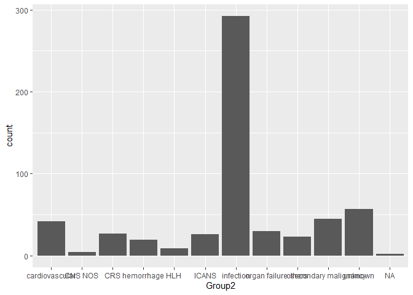<!-- -->

```r
# Preparation of table to exclude unknown, others and combine neurotox
# reducing the number of groups from 11 to 10
NRM_calc_g10 <- NRM_calc %>%
  filter(Group2 != "NA") %>% #exlcusion of studies without non-relapse associated death
  mutate(Group2 = case_when(
    Group2 == "CNS NOS" ~ "neurotoxicity/ICANS",
    Group2 == "ICANS" ~ "neurotoxicity/ICANS",
    Group2 == "secondary malignancy" ~ "malignancy",
    Group2 == "cardiovascular" ~ "cardiovascular/respiratory",
    TRUE ~ Group2  # Keep other values unchanged
  ))

# Preparation of "g8" table with the following changes for visualization and further analysis
# - Combining CNS NOS and ICANS to one single group
# - Combining others, unknown and organ failure to one single group
# - Renmaing malignancy and cardiovascular groups to reflect entirety of cases
# - in total reducing the number of groups from 11 to 8
NRM_calc_g8 <- NRM_calc %>%
  filter(Group2 != "NA") %>% #exlcusion of studies without non-relapse associated death
  mutate(Group2 = case_when(
    Group2 == "CNS NOS" ~ "neurotoxicity/ICANS",
    Group2 == "ICANS" ~ "neurotoxicity/ICANS",
    Group2 == "others" ~ "organ failure/others/unknown",
    Group2 == "unknown" ~ "organ failure/others/unknown",
    Group2 == "organ failure" ~ "organ failure/others/unknown",
    Group2 == "secondary malignancy" ~ "malignancy",
    Group2 == "cardiovascular" ~ "cardiovascular/respiratory",
    TRUE ~ Group2  # Keep other values unchanged
  ))

# Checking distribution of g8
NRM_calc_g8 %>%
  ggplot()+
  geom_bar(aes(x = Group2))
```

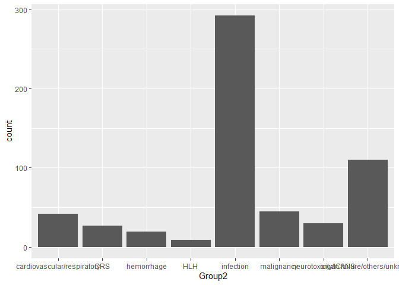<!-- -->

```r
# Subsetting g8 data set by removing unknown group
NRM_calc_g8_known <- NRM_calc_g8 %>%
  filter(Group2 != "organ failure/others/unknown")

unique(NRM_calc_g8$Group2)
```

```
## [1] "cardiovascular/respiratory"   "hemorrhage"                  
## [3] "organ failure/others/unknown" "neurotoxicity/ICANS"         
## [5] "infection"                    "CRS"                         
## [7] "malignancy"                   "HLH"
```

```r
# Creating a vectors containing causes of death from different subsets
rownames_deaths <- NRM_calc %>%
  ungroup() %>%
  distinct(Group) %>%
  unlist() %>%
  as.vector()

rownames_deaths_g8 <- NRM_calc_g8 %>%
  ungroup() %>%
  distinct(Group) %>%
  unlist() %>%
  as.vector()

rownames_deaths_g8_known <- NRM_calc_g8_known %>%
  ungroup() %>%
  distinct(Group2) %>%
  unlist() %>%
  as.vector()

# Creating data frames with death group percentages by: entity
NRM_calc_g8_entity_known <- NRM_calc_g8_known %>%
  group_by(Group2, Entity) %>%
  count(Group2) %>%
  pivot_wider(names_from = Entity, values_from = n) %>%
  mutate(LBCL_perc = LBCL / sum(.$LBCL, na.rm = T)*100,
         IL_perc = IL / sum(.$IL, na.rm = T)*100,
         MCL_perc = MCL / sum(.$MCL, na.rm = T)*100,
         MM_perc = MM / sum(.$MM, na.rm = T)*100,) %>%
  pivot_longer(cols = c("LBCL_perc", "IL_perc", "MCL_perc", "MM_perc"),
               names_to = "entity_perc", values_to = "entity_perc_value")%>%
  mutate(entity_perc = case_when(
    entity_perc == "LBCL_perc" ~ "LBCL",
    entity_perc == "IL_perc" ~ "IL",
    entity_perc == "MCL_perc" ~ "MCL",
    entity_perc == "MM_perc" ~ "MM"
  ))


# Calculating Chi-square test for Entity
entity_chisq <- NRM_calc_g8_known %>%
  #filter(complete.cases(Group)) %>%
  group_by(Group2, Entity) %>%
  count(Group2) %>%
  pivot_wider(names_from = Entity, values_from = n) %>%
  mutate(LBCL_perc = LBCL / sum(.$LBCL, na.rm = T)*100,
         IL_perc = IL / sum(.$IL, na.rm = T)*100,
         MCL_perc = MCL / sum(.$MCL, na.rm = T)*100,
         MM_perc = MM / sum(.$MM, na.rm = T)*100,) %>%
  ungroup() %>%
  select('LBCL', 'IL', 'MCL', 'MM') %>%
  as.matrix()

entity_chisq[is.na(entity_chisq)] <- 0

rownames(entity_chisq) <- rownames_deaths_g8_known

chisq.test(entity_chisq)
```

```
## Warning in chisq.test(entity_chisq): Chi-squared approximation may be incorrect
```

```
## 
## 	Pearson's Chi-squared test
## 
## data:  entity_chisq
## X-squared = 19.376, df = 18, p-value = 0.369
```

```r
colSums(entity_chisq)
```

```
## LBCL   IL  MCL   MM 
##  349   10   32   73
```

```r
# Creating data frames with death group percentages by: setting

NRM_calc_g8_setting_known <- NRM_calc_g8_known %>%
  group_by(Group2, Setting) %>%
  count(Group2) %>%
  pivot_wider(names_from = Setting, values_from = n) %>%
  mutate(CT_perc = CT / sum(.$CT, na.rm = T)*100,
         RW_perc = RW / sum(.$RW, na.rm = T)*100) %>%
  pivot_longer(cols = c("CT_perc", "RW_perc"),
               names_to = "setting_perc", values_to = "setting_perc_value") %>%
  mutate(setting_perc = case_when(
    setting_perc == "CT_perc" ~ "CT",
    setting_perc == "RW_perc" ~ "RW",
  ))

NRM_calc_g8_setting_known_woCovid <- NRM_calc_g8_known %>%
  group_by(Group2, Setting) %>%
  count(Group2) %>%
  pivot_wider(names_from = Setting, values_from = n)

# Additional subgroup analysis correcting for COVID cases among infection cases
# Changing Infection numbers for COVID numbers
NRM_calc_g8_setting_known_woCovid[5,2] <- 50
NRM_calc_g8_setting_known_woCovid[5,3] <- 187

NRM_calc_g8_setting_known_woCovid <- NRM_calc_g8_setting_known_woCovid %>%
  mutate(CT_perc = CT / sum(.$CT, na.rm = T)*100,
         RW_perc = RW / sum(.$RW, na.rm = T)*100) %>%
  pivot_longer(cols = c("CT_perc", "RW_perc"),
               names_to = "setting_perc", values_to = "setting_perc_value") %>%
  mutate(setting_perc = case_when(
    setting_perc == "CT_perc" ~ "CT",
    setting_perc == "RW_perc" ~ "RW",
  ))

# Calculating Chi-square test for Setting
setting_chisq <- NRM_calc_g8_known %>%
  #filter(complete.cases(Group)) %>%
  group_by(Group2, Setting) %>%
  count(Group2) %>%
  pivot_wider(names_from = Setting, values_from = n) %>%
  mutate(CT_perc = CT / sum(.$CT, na.rm = T)*100,
         RW_perc = RW / sum(.$RW, na.rm = T)*100) %>%
  ungroup() %>%
  select('CT', 'RW') %>%
  as.matrix()

rownames(setting_chisq) <- rownames_deaths_g8_known

chisq.test(setting_chisq)
```

```
## Warning in chisq.test(setting_chisq): Chi-squared approximation may be
## incorrect
```

```
## 
## 	Pearson's Chi-squared test
## 
## data:  setting_chisq
## X-squared = 18.936, df = 6, p-value = 0.004273
```

```r
colSums(setting_chisq)
```

```
##  CT  RW 
## 127 337
```

```r
# Calculating Chi-square test for Setting without COVID cases
NRM_calc_g8_setting_known_woCovid_chi <- NRM_calc_g8_known %>%
  group_by(Group2, Setting) %>%
  count(Group2) %>%
  pivot_wider(names_from = Setting, values_from = n)

# Additional subgroup analysis correcting for COVID cases among infection cases
# Changing Infection numbers for COVID numbers
NRM_calc_g8_setting_known_woCovid_chi[5,2] <- 50
NRM_calc_g8_setting_known_woCovid_chi[5,3] <- 187

setting_woCovid_chisq <-NRM_calc_g8_setting_known_woCovid_chi |>
  ungroup() |>
  select('CT', 'RW') |>
  as.matrix()


rownames(setting_woCovid_chisq) <- rownames_deaths_g8_known

chisq.test(setting_woCovid_chisq)
```

```
## Warning in chisq.test(setting_woCovid_chisq): Chi-squared approximation may be
## incorrect
```

```
## 
## 	Pearson's Chi-squared test
## 
## data:  setting_woCovid_chisq
## X-squared = 23.357, df = 6, p-value = 0.0006853
```

```r
colSums(setting_woCovid_chisq)
```

```
##  CT  RW 
## 102 307
```

```r
products <- NRM_calc %>%
  filter(Product != "Tisa-cel+Axi-cel") %>%
  ungroup() %>%
  select(Product) %>%
  distinct(Product) %>%
  as.vector()


NRM_calc_g8_product_known <- NRM_calc_g8_known %>%
  #filter(complete.cases(Group)) %>%
  group_by(Group2, Product) %>%
  count(Group2) %>%
  pivot_wider(names_from = Product, values_from = n) %>%
  mutate(Axi_perc = `Axi-cel` / sum(.$`Axi-cel`, na.rm = T)*100,
         Liso_perc = `Liso-cel` / sum(.$`Liso-cel`, na.rm = T)*100,
         Brexu_perc = `Brexu-cel` / sum(.$`Brexu-cel`, na.rm = T)*100, 
         Tisa_perc = `Tisa-cel` / sum(.$`Tisa-cel`, na.rm = T)*100, 
         Cilta_perc = `Cilta-cel` / sum(.$`Cilta-cel`, na.rm = T)*100, 
         Ide_perc = `Ide-cel` / sum(.$`Ide-cel`, na.rm = T)*100) %>%
  pivot_longer(cols = c("Axi_perc", "Liso_perc", "Brexu_perc", "Tisa_perc", "Cilta_perc", "Ide_perc"),
               names_to = "product_perc", values_to = "product_perc_value") %>%
  mutate(product_perc = case_when(
    product_perc == "Axi_perc" ~ "Axi-cel",
    product_perc == "Liso_perc" ~ "Liso-cel",
    product_perc == "Brexu_perc" ~ "Brexu-cel",
    product_perc == "Tisa_perc" ~ "Tisa-cel",
    product_perc == "Cilta_perc" ~ "Cilta-cel",
    product_perc == "Ide_perc" ~ "Ide-cel",
  ))


# Calculating Chi-square test for Product und Product comparisons
product_chisq <- NRM_calc_g8_known %>%
  #filter(complete.cases(Group)) %>%
  group_by(Group2, Product) %>%
  count(Group2) %>%
  pivot_wider(names_from = Product, values_from = n) %>%
  mutate(Axi_perc = `Axi-cel` / sum(.$`Axi-cel`, na.rm = T)*100,
         Liso_perc = `Liso-cel` / sum(.$`Liso-cel`, na.rm = T)*100,
         Brexu_perc = `Brexu-cel` / sum(.$`Brexu-cel`, na.rm = T)*100, 
         Tisa_perc = `Tisa-cel` / sum(.$`Tisa-cel`, na.rm = T)*100, 
         Cilta_perc = `Cilta-cel` / sum(.$`Cilta-cel`, na.rm = T)*100, 
         Ide_perc = `Ide-cel` / sum(.$`Ide-cel`, na.rm = T)*100) %>%
  ungroup() %>%
  select('Axi-cel', 'Liso-cel', 'Brexu-cel', 'Tisa-cel', 'Cilta-cel', 'Ide-cel') %>%
  as.matrix()

product_chisq[is.na(product_chisq)] <- 0

chisq.test(product_chisq)
```

```
## Warning in chisq.test(product_chisq): Chi-squared approximation may be
## incorrect
```

```
## 
## 	Pearson's Chi-squared test
## 
## data:  product_chisq
## X-squared = 28.413, df = 30, p-value = 0.5485
```

```r
colSums(product_chisq)
```

```
##   Axi-cel  Liso-cel Brexu-cel  Tisa-cel Cilta-cel   Ide-cel 
##       236        14        32        31        32        34
```

```r
# Chisquare Axi vs Liso Vs Tisa
product_chisq_Axi_comp <- NRM_calc_g8_known %>%
  filter(Product == "Axi-cel" | Product == "Liso-cel" | Product == "Tisa-cel") %>%
  group_by(Group2, Product) %>%
  count(Group2) %>%
  pivot_wider(names_from = Product, values_from = n) %>%
  mutate(Axi_perc = `Axi-cel` / sum(.$`Axi-cel`, na.rm = T)*100,
         Liso_perc = `Liso-cel` / sum(.$`Liso-cel`, na.rm = T)*100,
         Tisa_perc = `Tisa-cel` / sum(.$`Tisa-cel`, na.rm = T)*100) %>%
  ungroup() %>%
  select('Axi-cel', 'Liso-cel',  'Tisa-cel') %>%
  as.matrix()

product_chisq_Axi_comp[is.na(product_chisq_Axi_comp)] <- 0

chisq.test(product_chisq_Axi_comp)
```

```
## Warning in chisq.test(product_chisq_Axi_comp): Chi-squared approximation may be
## incorrect
```

```
## 
## 	Pearson's Chi-squared test
## 
## data:  product_chisq_Axi_comp
## X-squared = 14.262, df = 12, p-value = 0.2843
```

```r
# Chisquare Axi Vs Tisa
product_chisq_Axi_comp2 <- NRM_calc_g8_known %>%
  filter(Product == "Axi-cel"  | Product == "Tisa-cel") %>%
  group_by(Group2, Product) %>%
  count(Group2) %>%
  pivot_wider(names_from = Product, values_from = n) %>%
  mutate(Axi_perc = `Axi-cel` / sum(.$`Axi-cel`, na.rm = T)*100,
         Tisa_perc = `Tisa-cel` / sum(.$`Tisa-cel`, na.rm = T)*100) %>%
  ungroup() %>%
  select('Axi-cel', 'Tisa-cel') %>%
  as.matrix()

product_chisq_Axi_comp2[is.na(product_chisq_Axi_comp2)] <- 0

chisq.test(product_chisq_Axi_comp2)
```

```
## Warning in chisq.test(product_chisq_Axi_comp2): Chi-squared approximation may
## be incorrect
```

```
## 
## 	Pearson's Chi-squared test
## 
## data:  product_chisq_Axi_comp2
## X-squared = 6.6545, df = 6, p-value = 0.354
```

```r
# Chisquare Ide Vs Cilta
product_chisq_Ide_comp <- NRM_calc_g8_known %>%
  filter(Product == "Ide-cel" | Product == "Cilta-cel") %>%
  group_by(Group2, Product) %>%
  count(Group2) %>%
  pivot_wider(names_from = Product, values_from = n) %>%
  mutate(Cilta_perc = `Cilta-cel` / sum(.$`Cilta-cel`, na.rm = T)*100, 
         Ide_perc = `Ide-cel` / sum(.$`Ide-cel`, na.rm = T)*100) %>%
  ungroup() %>%
  select('Ide-cel', 'Cilta-cel') %>%
  as.matrix()

product_chisq_Ide_comp[is.na(product_chisq_Ide_comp)] <- 0

chisq.test(product_chisq_Ide_comp)
```

```
## Warning in chisq.test(product_chisq_Ide_comp): Chi-squared approximation may be
## incorrect
```

```
## 
## 	Pearson's Chi-squared test
## 
## data:  product_chisq_Ide_comp
## X-squared = 4.4196, df = 6, p-value = 0.6201
```


## Publication bias analysis - Funnel plots


```r
# Overall

svg(file = "Figures/funnel_all.svg")
funnel(NRM_meta, common = T,level = 0.95)
dev.off()
```

```
## png 
##   2
```

```r
metabias(NRM_meta, method.bias = "linreg")
```

```
## Linear regression test of funnel plot asymmetry
## 
## Test result: t = -2.98, df = 50, p-value = 0.0045
## Bias estimate: -1.2086 (SE = 0.4061)
## 
## Details:
## - multiplicative residual heterogeneity variance (tau^2 = 2.4851)
## - predictor: standard error
## - weight:    inverse variance
## - reference: Egger et al. (1997), BMJ
```

```r
# LBCL Studies
NRM_meta_LBCL <- metaprop(event = deaths, n = Patient_number, studlab = Study_Name, 
                          data = NRM_distinct, method = "GLMM", subset = Entity == "LBCL")

svg(file = "Figures/funnel_LBCL.svg")
funnel(NRM_meta_LBCL, common = TRUE, level = 0.95)
dev.off()
```

```
## png 
##   2
```

```r
metabias(NRM_meta_LBCL, method.bias = "linreg")
```

```
## Linear regression test of funnel plot asymmetry
## 
## Test result: t = -3.03, df = 29, p-value = 0.0052
## Bias estimate: -1.5991 (SE = 0.5285)
## 
## Details:
## - multiplicative residual heterogeneity variance (tau^2 = 2.8022)
## - predictor: standard error
## - weight:    inverse variance
## - reference: Egger et al. (1997), BMJ
```

```r
# MCL Studies
NRM_meta_MCL <- metaprop(event = deaths, n = Patient_number, studlab = Study_Name, 
                         data = NRM_distinct, method = "GLMM", subset = Entity == "MCL")

svg(file = "Figures/funnel_MCL.svg")
funnel(NRM_meta_MCL, common = TRUE, level = 0.95)
dev.off()
```

```
## png 
##   2
```

```r
metabias(NRM_meta_MCL, method.bias = "linreg", k.min = 2)
```

```
## Linear regression test of funnel plot asymmetry
## 
## Test result: t = 0.41, df = 3, p-value = 0.7123
## Bias estimate: 0.6765 (SE = 1.6684)
## 
## Details:
## - multiplicative residual heterogeneity variance (tau^2 = 1.4983)
## - predictor: standard error
## - weight:    inverse variance
## - reference: Egger et al. (1997), BMJ
```

```r
# MM Studies
NRM_meta_MM <- metaprop(event = deaths, n = Patient_number, studlab = Study_Name, 
                        data = NRM_distinct, method = "GLMM", subset = Entity == "MM")

svg(file = "Figures/funnel_MM.svg")
funnel(NRM_meta_MM, common = TRUE, level = 0.95)
dev.off()
```

```
## png 
##   2
```

```r
metabias(NRM_meta_MM, method.bias = "linreg")
```

```
## Linear regression test of funnel plot asymmetry
## 
## Test result: t = -1.77, df = 11, p-value = 0.1052
## Bias estimate: -1.5461 (SE = 0.8758)
## 
## Details:
## - multiplicative residual heterogeneity variance (tau^2 = 1.8960)
## - predictor: standard error
## - weight:    inverse variance
## - reference: Egger et al. (1997), BMJ
```

```r
# IL Studies
NRM_meta_IL <- metaprop(event = deaths, n = Patient_number, studlab = Study_Name, 
                        data = NRM_distinct, method = "GLMM", subset = Entity == "IL")

svg(file = "Figures/funnel_IL.svg")
funnel(NRM_meta_IL, common = TRUE, level = 0.95)
dev.off()
```

```
## png 
##   2
```

```r
metabias(NRM_meta_IL, method.bias = "linreg", k.min = 2)
```

```
## Linear regression test of funnel plot asymmetry
## 
## Test result: t = -0.91, df = 1, p-value = 0.5288
## Bias estimate: -0.3544 (SE = 0.3880)
## 
## Details:
## - multiplicative residual heterogeneity variance (tau^2 = 0.0608)
## - predictor: standard error
## - weight:    inverse variance
## - reference: Egger et al. (1997), BMJ
```

```r
# RW Studies
NRM_meta_RW <- metaprop(event = deaths, n = Patient_number, studlab = Study_Name, 
                        data = NRM_distinct, method = "GLMM", subset = Setting == "RW")

svg(file = "Figures/funnel_RW.svg")
funnel(NRM_meta_RW, common = TRUE, level = 0.95)
dev.off()
```

```
## png 
##   2
```

```r
metabias(NRM_meta_RW, method.bias = "linreg")
```

```
## Linear regression test of funnel plot asymmetry
## 
## Test result: t = -2.49, df = 32, p-value = 0.0180
## Bias estimate: -1.1471 (SE = 0.4599)
## 
## Details:
## - multiplicative residual heterogeneity variance (tau^2 = 2.5591)
## - predictor: standard error
## - weight:    inverse variance
## - reference: Egger et al. (1997), BMJ
```

```r
# CT Studies
NRM_meta_CT <- metaprop(event = deaths, n = Patient_number, studlab = Study_Name, 
                        data = NRM_distinct, method = "GLMM", subset = Setting == "CT")

svg(file = "Figures/funnel_CT.svg")
funnel(NRM_meta_CT, common = TRUE,level = 0.95)
dev.off()
```

```
## png 
##   2
```

```r
metabias(NRM_meta_CT, method.bias = "linreg", k.min = 2)
```

```
## Linear regression test of funnel plot asymmetry
## 
## Test result: t = -2.73, df = 16, p-value = 0.0147
## Bias estimate: -2.5320 (SE = 0.9258)
## 
## Details:
## - multiplicative residual heterogeneity variance (tau^2 = 1.9428)
## - predictor: standard error
## - weight:    inverse variance
## - reference: Egger et al. (1997), BMJ
```

## Sensitivity analysis

```r
## Impact of studies n > 80
NRM_meta_n80 <- metaprop(event = deaths, n = Patient_number, studlab = Study_Name, 
                         data = NRM_distinct , method = "GLMM", subset = Patient_number > 80)

meta_results_n80 <- extract_meta_results_1(NRM_meta_n80)

metafor::funnel(NRM_meta_n80, common = F, level = 0.95)
```

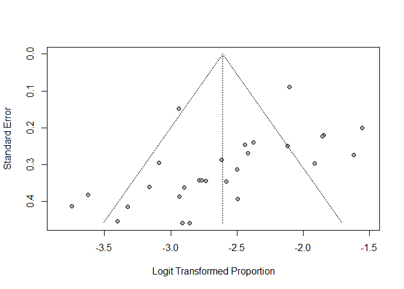<!-- -->

```r
metabias(NRM_meta_n80)
```

```
## Linear regression test of funnel plot asymmetry
## 
## Test result: t = -3.02, df = 26, p-value = 0.0057
## Bias estimate: -2.3683 (SE = 0.7854)
## 
## Details:
## - multiplicative residual heterogeneity variance (tau^2 = 3.3383)
## - predictor: standard error
## - weight:    inverse variance
## - reference: Egger et al. (1997), BMJ
```

```r
## Impact of studies with overlap
NRM_meta_overlap <- NRM_distinct |>
  filter(is.na(Potential_overlap_percent)) |>
  metaprop(event = deaths, n = Patient_number, studlab = Study_Name , method = "GLMM")

meta_results_overlap <- extract_meta_results_1(NRM_meta_overlap)

metafor::funnel(NRM_meta_overlap, common = F, level = 0.95)
```

<!-- -->

```r
metabias(NRM_meta_overlap)
```

```
## Linear regression test of funnel plot asymmetry
## 
## Test result: t = -2.74, df = 43, p-value = 0.0090
## Bias estimate: -1.1250 (SE = 0.4111)
## 
## Details:
## - multiplicative residual heterogeneity variance (tau^2 = 2.3484)
## - predictor: standard error
## - weight:    inverse variance
## - reference: Egger et al. (1997), BMJ
```

```r
## Total number and percentage of potential cases overlapping 
sum(NRM_distinct$Potential_overlap_number, na.rm = T) #148 total cases
```

```
## [1] 148
```

```r
sum(NRM_distinct$Patient_number, na.rm = T) #7604 total cases
```

```
## [1] 7604
```

```r
148/7604*100 #1.95% of all cases
```

```
## [1] 1.946344
```

```r
NRM_distinct |>
  ungroup()|>
  group_by(Setting) |>
  dplyr::summarize(total_patients = sum(Patient_number))
```

```
## # A tibble: 2 × 2
##   Setting total_patients
##   <chr>            <dbl>
## 1 CT                2015
## 2 RW                5589
```

```r
148/5589*100 #2.64% of all RW cases
```

```
## [1] 2.648059
```


# Manuscript figures

## Figure 2


```r
forest(NRM_meta_setting, overall = T, pooled.events = T,
       xlab = "NRM point estimate", weight.study = "random", 
       method.ci = "WS", common = F, random = T, smlab = "", digits = 3,
       xlim = c(0,0.25), leftcols = c("studlab", "event", "n", "effect", "ci"),
       rightcols = F, zero.pval = T, JAMA.pval = T, col.square = "darkblue",
       col.square.lines = "darkblue", col.diamond.random = "#73C2FB",
       bottom.lr = T, ff.lr = T, print.tau2 = F, header.line = T,
       width = 10, height = 10,
       sortvar = Entity, file = "Figures/SG_Setting.svg")
```

## Figure 3
### Fig. 3A - Bubble plot

```r
#ENTITY
entity_FU <- NRM_distinct |>
  filter(FU != is.na(FU))|>
  ungroup()|>
  group_by(Entity)|>
  dplyr::summarize(median(FU))

bubble_entity <- left_join(meta_results_entity, entity_FU, 
                           by = join_by(`meta_object$subgroup.levels` == Entity))

p_bubble_entity <- ggplot()+
  geom_jitter(data = bubble_entity,
              aes(x = `median(FU)`, y = 100*PointEst.ran, size = patient_sum,
                  color = factor(`meta_object$subgroup.levels`, levels = c("IL", "LBCL", "MM", "MCL"))),
              alpha = 1, shape = 19)+
  geom_jitter(data = NRM_distinct, 
              aes(x = FU, y = 100*NRM_calculated, size = Patient_number,
                  color = factor(Entity, levels = c("IL", "LBCL", "MM", "MCL"))),
              alpha = 0.3, shape = 19)+
  # geom_text_repel(aes(label = Study_Name), size = 3)+
  # scale_size_continuous(range = c(1,8))+
  scale_size(breaks = c(100, 500, 1000, 2000, 3000), range = c(2,14))+
  labs(x = "Follow-up [months]", y = "NRM point estimate [%]", 
       color = "Entity", size = "Patients")+
  guides(color = guide_legend(override.aes = aes(size = 5)))+
  scale_fill_manual(values  = c("#0073C2FF", "#EFC000FF", "#CD534CFF", "#868686FF"))+
  scale_color_manual(values = c( "#0073C2FF", "#EFC000FF", "#CD534CFF", "#868686FF"))+
  theme_classic()+
  theme(panel.background = element_rect(colour = "black", size=1),
        aspect.ratio = 1, axis.text.x = element_text(size = 11),
        axis.text.y = element_text(size = 11),
        axis.title.y = element_text(size = 11, margin = margin(r = 10)),
        legend.key = element_blank())
```

```
## Warning: The `size` argument of `element_rect()` is deprecated as of ggplot2 3.4.0.
## ℹ Please use the `linewidth` argument instead.
## This warning is displayed once every 8 hours.
## Call `lifecycle::last_lifecycle_warnings()` to see where this warning was
## generated.
```

```r
p_bubble_entity
```

```
## Warning: Removed 1 row containing missing values or values outside the scale range
## (`geom_point()`).
```

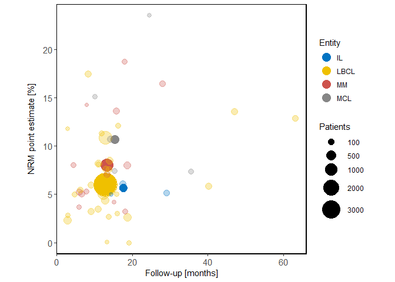<!-- -->

### Fig. 3B - Entity comparison

```r
# Figure 3B - creating a combined data frame from entity and overall NRM
meta_results_all$`meta_object$k.all` <- "All"
meta_results_all$p.ran <- NA
names(meta_results_all)[1] <- "meta_object$subgroup.levels"
meta_results_entity_all <- rbind(meta_results_entity, meta_results_all)

psq_entity <- ggplot()+
  geom_errorbar(data = meta_results_entity_all,
                aes(x = `meta_object$subgroup.levels`, 
                    ymin = lower.ran*100, ymax = upper.ran*100,
                    color = `meta_object$subgroup.levels`), width = 0.1)+
  geom_point(data = meta_results_entity_all, 
             aes(x = `meta_object$subgroup.levels`, 
                 y = PointEst.ran*100, color = `meta_object$subgroup.levels`), 
             size = 6,  shape = 18,
             position = position_dodge(width = 0.1))+
  geom_jitter(data = NRM_distinct, 
              aes(x = Entity, 
                  y = NRM_calculated*100, color = Entity), alpha = 0.3, shape = 19, 
              width = 0.3, height = 0.2, size = 4)+
  coord_flip()+
  scale_fill_manual(values  = c("black", "#0073C2FF", "#EFC000FF","#868686FF", "#CD534CFF"))+
  scale_color_manual(values = c("black", "#0073C2FF", "#EFC000FF", "#868686FF", "#CD534CFF"))+
  scale_y_continuous(limits = c (0,25), expand = c(0.01,0.01))+
  scale_x_discrete(limits = c("All", "IL", "LBCL", "MM", "MCL"))+
  labs(x = "", y = "NRM point estimate [%]")+
  guides(fill = "none", color = "none")+
  theme_classic() +
  theme(panel.background = element_rect(colour = "black", size=0.5),
        axis.text.x = element_text(size = 11),
        axis.text.y = element_text(size = 11),
        axis.title.y = element_text(size = 11, margin = margin(r = 10)))

psq_entity <- psq_entity +
  annotate("text", x = 1, y = 18, label = paste("p =", round(meta_results_entity_all$p.ran[1], 3)),
           size = 4, color = "black")


psq_entity
```

```
## Warning: Removed 1 row containing missing values or values outside the scale range
## (`geom_point()`).
```

<!-- -->

### Fig. 3C - Product comparison in LBCL

```r
# Entity-based subgroup analyses
# Products within entities
p3_LBCL_product <- ggplot()+
  geom_errorbar(data = meta_results_LBCL_product,
                aes(x = `meta_object$subgroup.levels`,
                    ymin = lower.ran*100, ymax = upper.ran*100,
                    color = `meta_object$subgroup.levels`), width = 0.1)+
  geom_point(data = meta_results_LBCL_product,
             aes(x = `meta_object$subgroup.levels`,
                 y = PointEst.ran*100, color = `meta_object$subgroup.levels`),
             size = 6,  shape = 18,
             position = position_dodge(width = 0.1))+
  geom_jitter(data = NRM_distinct |> filter(Entity == "LBCL"), 
              aes(x = Product, 
                  y = NRM_calculated*100, color = Entity), alpha = 0.3, shape = 19, 
              width = 0.3, height = 0.2, size = 4)+
  scale_color_manual(values = c("#EFC000FF", "#EFC000FF",
                                "#EFC000FF", "#EFC000FF","#EFC000FF", "#EFC000FF"))+
  scale_y_continuous(limits = c (0,20), expand = c(0.05,0.01))+
  scale_x_discrete(limits = c("Tisa-cel", "Liso-cel", "Axi-cel"))+
  labs(x = "", y = "NRM point estimate [%]")+
  guides(fill = "none", color = "none")+
  # force_panelsizes(rows = unit(3.5, "in"),
  #                  cols = unit(2.5, "in"))+
  theme_classic() +
  theme(axis.text.x = element_text(size = 11),
        axis.text.y = element_text(size = 11),
        axis.title.y = element_text(size = 11, margin = margin(r = 10)))

p3_LBCL_product <- p3_LBCL_product +
  annotate("text", x = 2, y = 0.8,
           label = ifelse(meta_results_LBCL_product$p.ran[1] < 0.001, paste("p < 0.001"), paste("p =", round(meta_results_LBCL_product$p.ran[1], 3))),
           size = 4, color = "black")

p3_LBCL_product
```

```
## Warning: Removed 4 rows containing missing values or values outside the scale range
## (`geom_point()`).
```

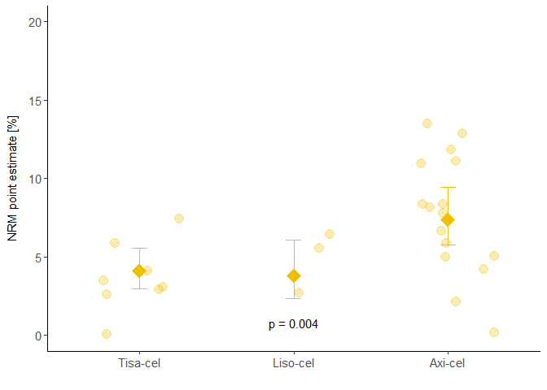<!-- -->

### Fig. 3D - Meta-regression model LBCL

```r
pmr_LBCL_model <- ggplot(results_LBCL_model |> filter(variable != "Intercept"))+
  #  geom_hline(yintercept = 0, linetype = "dashed", color = "grey")+
  geom_errorbar(aes(x = variable, ymin = lower, ymax = upper), width = 0.3, size = 0.7, color = "darkgrey")+
  geom_point(aes(x = variable, y = V1), size = 4, shape = 15, color = "#EFC000FF")+
  #  geom_text(aes(x = variable, y = 1.5,
  #               label = ifelse(p_value < 0.001, paste("p < 0.001"), paste("p =", round(p_value, 3))),))+
  coord_flip()+
  scale_y_continuous(limits = c (-2, 2), expand = c(0.01,0.01))+
  scale_x_discrete(limits = c("FU > median", "FU < median [ref.]","dummy FU",
                              "Inclusion before 2020", "Inclusion after 2020 [ref.]","dummy Inc", "Later", 
                              "Earlier [ref.]" ,"dummy line", "RW", "CT [ref.]", "dummy setting",
                              "Tisa-cel","Liso-cel", "Axi-cel [ref.]", "dummy product"))+
  labs(x = "", y = "Estimate [95% CI]")+
  guides(fill = "none", color = "none")+
  # force_panelsizes(rows = unit(3.5, "in"),
  #                  cols = unit(5, "in"))+
  theme_classic() +
  theme(axis.text.x = element_text(size = 8),
        axis.title.x = element_text(size=8),
        axis.text.y = element_text(size = 11),
        axis.title.y = element_text(size = 11, margin = margin(r = 10)),
        axis.line.y = element_blank(),
        axis.ticks.y = element_blank(),
        # axis.title.x = element_blank()
  )
```

```
## Warning: Using `size` aesthetic for lines was deprecated in ggplot2 3.4.0.
## ℹ Please use `linewidth` instead.
## This warning is displayed once every 8 hours.
## Call `lifecycle::last_lifecycle_warnings()` to see where this warning was
## generated.
```

```r
pmr_LBCL_model
```

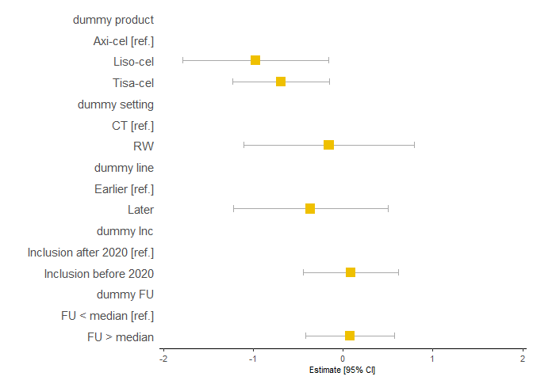<!-- -->

### Fig. 3E - Product comparison in MM

```r
p2_MM_product <- ggplot()+
  geom_errorbar(data = meta_results_MM_product,
                aes(x = `meta_object$subgroup.levels`,
                    ymin = lower.ran*100, ymax = upper.ran*100,
                    color = `meta_object$subgroup.levels`), width = 0.1)+
  geom_point(data = meta_results_MM_product,
             aes(x = `meta_object$subgroup.levels`,
                 y = PointEst.ran*100, color = `meta_object$subgroup.levels`),
             size = 6,  shape = 18,
             position = position_dodge(width = 0.1))+
  geom_jitter(data = NRM_distinct |> filter(Entity == "MM"), 
              aes(x = Product, 
                  y = NRM_calculated*100, color = Entity), alpha = 0.3, shape = 19, 
              width = 0.3, height = 0.2, size = 4)+
  scale_color_manual(values = c( "#CD534CFF",  "#CD534CFF",  "#CD534CFF",
                                 "#CD534CFF", "#CD534CFF", "#CD534CFF"))+
  scale_y_continuous(limits = c (0,20), expand = c(0.05,0.01))+
  scale_x_discrete(limits = c("Ide-cel", "Cilta-cel"))+
  labs(x = "", y = "NRM point estimate [%]")+
  guides(fill = "none", color = "none")+
  # force_panelsizes(rows = unit(3.5, "in"),
  #                  cols = unit(2.5, "in"))+
  theme_classic() +
  theme(axis.text.x = element_text(size = 11),
        axis.text.y = element_text(size = 11),
        axis.title.y = element_text(size = 11, margin = margin(r = 10)))

p2_MM_product <- p2_MM_product +
  annotate("text", x = 1.5, y = 0.8,
           label = ifelse(meta_results_MM_product$p.ran[1] < 0.001, paste("p < 0.001"), paste("p =", round(meta_results_MM_product$p.ran[1], 3))),
           size = 4, color = "black")

p2_MM_product
```

```
## Warning: Removed 1 row containing missing values or values outside the scale range
## (`geom_point()`).
```

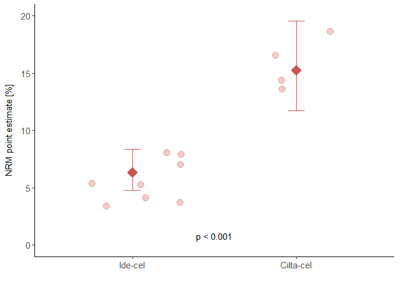<!-- -->

### Fig. 3F - Meta-regression model MM

```r
pmr_MM_model <- ggplot(results_MM_model |> filter(variable != "Intercept"))+
  # geom_hline(yintercept = 0, linetype = "dashed", color = "grey")+
  geom_errorbar(aes(x = variable, ymin = lower, ymax = upper), width = 0.3, size = 0.7, color = "darkgrey")+
  geom_point(aes(x = variable, y = V1), size = 4, shape = 15, color = "#CD534CFF")+
  #  geom_text(aes(x = variable, y = 1.5,
  #                label = ifelse(p_value < 0.001, paste("p < 0.001"), paste("p =", round(p_value, 3))),))+
  coord_flip()+
  scale_y_continuous(limits = c (-2, 2), expand = c(0.01,0.01))+
  scale_x_discrete(limits = c("FU > median", "FU < median [ref.]","dummy FU",
                              "Inclusion before 2020", "Inclusion after 2020 [ref.]","dummy Inc", "Later", 
                              "Earlier [ref.]" ,"dummy line", "RW", "CT [ref.]", "dummy setting", 
                              "Ide-cel", "Cilta-cel [ref.]", "dummy product", "dummy plus"))+
  labs(x = "", y = "Estimate [95% CI]")+
  guides(fill = "none", color = "none")+
  # force_panelsizes(rows = unit(3.5, "in"),
  #                  cols = unit(5, "in"))+
  theme_classic() +
  theme(axis.text.x = element_text(size = 8),
        axis.title.x = element_text(size = 8),
        axis.text.y = element_text(size = 11),
        axis.title.y = element_text(size = 11, margin = margin(r = 10)),
        axis.line.y = element_blank(),
        axis.ticks.y = element_blank(),
        # axis.title.x = element_blank()
  )

pmr_MM_model
```

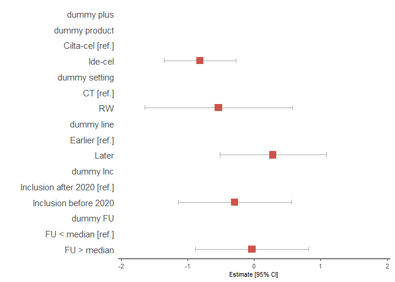<!-- -->


## Figure 4
### Fig 4B - COD distribution treatment setting


```r
p_cod2_setting <- ggplot(NRM_calc_g8_setting_known, 
                         aes(x = setting_perc,
                             y = setting_perc_value,
                             fill = factor(Group2, c("HLH", "hemorrhage",
                                                     "CRS","neurotoxicity/ICANS",
                                                     "cardiovascular/respiratory", "malignancy",
                                                     "infection"))))+
  geom_col(position = "fill")+
  labs(x = "", y = "Cause of death [%]", fill = "Cause of death")+
  scale_fill_manual(values = lancet_7_rev)+
  scale_y_continuous(expand = c(0.01,0.01))+
  theme_classic()+
  theme(panel.background = element_rect(colour = "black", size=1),
        axis.text.x = element_text(size = 11),
        axis.text.y = element_text(size = 11),
        axis.title.y = element_text(size = 11, margin = margin(r = 10)),
        legend.key = element_blank())

p_cod2_setting
```

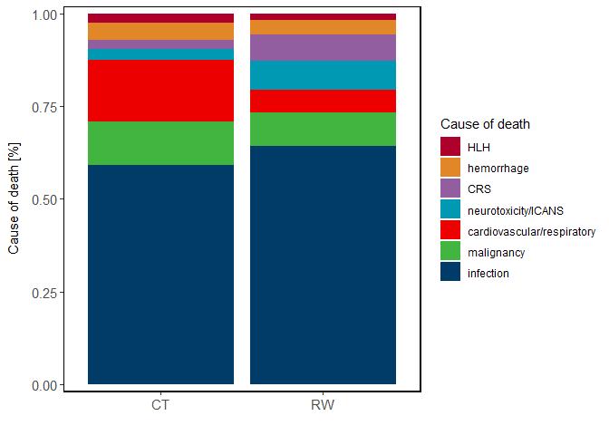<!-- -->

### Fig 4C - COD distribution entities


```r
p_cod4_entity <- ggplot(NRM_calc_g8_entity_known, 
                        aes(x = factor(entity_perc, c("IL", "LBCL", "MM", "MCL")),
                            y = entity_perc_value,
                            fill = factor(Group2, c("HLH", "hemorrhage",
                                                    "CRS","neurotoxicity/ICANS",
                                                    "cardiovascular/respiratory", "malignancy",
                                                    "infection"))))+
  geom_col(position = "fill")+
  labs(x = "", y = "Cause of death [%]", fill = "Cause of death")+
  scale_fill_manual(values = lancet_7_rev)+
  scale_y_continuous(expand = c(0.01,0.01))+
  theme_classic()+
  theme(panel.background = element_rect(colour = "black", size=1),
        axis.text.x = element_text(size = 11),
        axis.text.y = element_text(size = 11),
        axis.title.y = element_text(size = 11, margin = margin(r = 10)),
        legend.key = element_blank())

p_cod4_entity
```

```
## Warning: Removed 5 rows containing missing values or values outside the scale range
## (`geom_col()`).
```

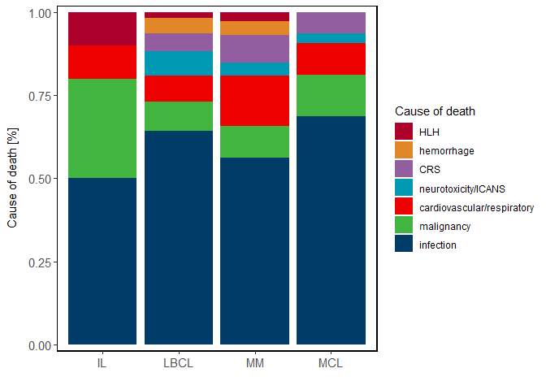<!-- -->


## Supplementary Figures
### Fig S1


```r
NRM_distinct %>% 
  filter(complete.cases(NRM_Reported)) %>%
  # filter(NRM_calculated != "NA")%>%
  #filter(Study_Name != "Jacobson_2022_B") %>%
  pivot_longer(cols = c("NRM_Reported", "NRM_calculated"), 
               names_to = "NRM_type", values_to = "NRM_value") %>% 
  wilcox.test(NRM_value ~ NRM_type, .)
```

```
## Warning in wilcox.test.default(x = DATA[[1L]], y = DATA[[2L]], ...): cannot
## compute exact p-value with ties
```

```
## 
## 	Wilcoxon rank sum test with continuity correction
## 
## data:  NRM_value by NRM_type
## W = 110, p-value = 0.5971
## alternative hypothesis: true location shift is not equal to 0
```

```r
pq_NRMcalc_vs_NRMrep <- NRM_distinct %>%
  filter(complete.cases(NRM_Reported)) %>%
  filter(NRM_calculated != "NA")%>%
  filter(Study_Name != "Jacobson_2022_B") %>%
  pivot_longer(cols = c(NRM_Reported, NRM_calculated), 
               names_to = "NRM_type", values_to = "NRM_value") %>%
  ggplot(aes(x = NRM_type, y = NRM_value*100, group = Study_Name))+
  geom_line(linewidth = 1.3, alpha = 0.7, colour = "darkgrey") +
  geom_point(size = 4, alpha = 0.7) +
  labs(y = "NRM [%]", x = "")+
  # ylim(2.5, 12.5)+
  scale_x_discrete(labels = c("NRM point estimate", "Reported NRM"), expand = c(0.2,0.2))+
  theme_classic()+
  theme(axis.text.x = element_text(size = 11),
        axis.text.y = element_text(size = 11),
        axis.title.y = element_text(size = 11, margin = margin(r = 10)))

pq_NRMcalc_vs_NRMrep
```

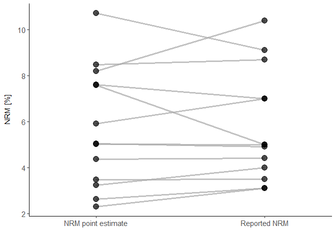<!-- -->

```r
pq_NRMdiff <- NRM_distinct %>%
  filter(complete.cases(NRM_Reported)) %>%
  filter(NRM_calculated != "NA")%>%
  filter(Study_Name != "Jacobson_2022_B") %>%
  mutate(NRM_diff = NRM_calculated - NRM_Reported) %>%
  ggplot(aes(x = reorder(Study_Name, NRM_diff), y = NRM_diff*100, alpha = abs(NRM_diff)))+
  geom_col()+
  #scale_y_continuous(limits = c(-2.5, 5), breaks = c(-2.5, 0, 2.5, 5, 7.5, 10))+
  scale_alpha_continuous(range = c (0.1,0.7))+
  labs(y = "Difference between NRMs [%]", x = "")+
  guides(alpha = "none")+
  coord_flip()+
  theme_classic()+
  theme(axis.text.x = element_text(size = 10),
        axis.text.y = element_text(size = 10),
        axis.title.y = element_text(size = 11, margin = margin(r = 10)))

pq_NRMdiff
```

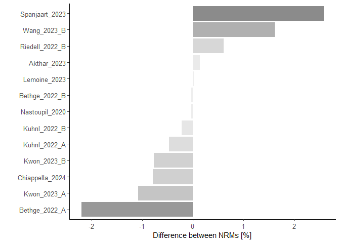<!-- -->

```r
pq_NRMcalc_cor_FU <- NRM_distinct %>%
  ggplot(aes(x = FU, y = NRM_calculated*100)) +
  geom_jitter(aes(color = Setting), size = 4, alpha = 0.8) +
  geom_smooth(method = "lm", se = T, linewidth = 1, colour = "orange", fill = "orange", alpha = 0.15)+
  #geom_text(aes(x = 50, y = 0, label = "Pearson r = 0.41, p = 0.01")) +
  labs(x = "FU [months]", y = "NRM point estimate [%]")+
  scale_x_continuous(expand = c(0.01,0))+
  scale_y_continuous(limits = c(0, 20), expand = c(0.01,0.01))+
  scale_color_manual(values = c("grey", "#3B3B3BFF"))+
  theme_classic() +
  theme(aspect.ratio = 1, axis.text.x = element_text(size = 11),
        axis.text.y = element_text(size = 11),
        axis.title.y = element_text(size = 11, margin = margin(r = 10)))

pq_NRMcalc_cor_FU
```

```
## `geom_smooth()` using formula = 'y ~ x'
```

```
## Warning: Removed 2 rows containing non-finite outside the scale range
## (`stat_smooth()`).
```

```
## Warning: Removed 4 rows containing missing values or values outside the scale range
## (`geom_point()`).
```

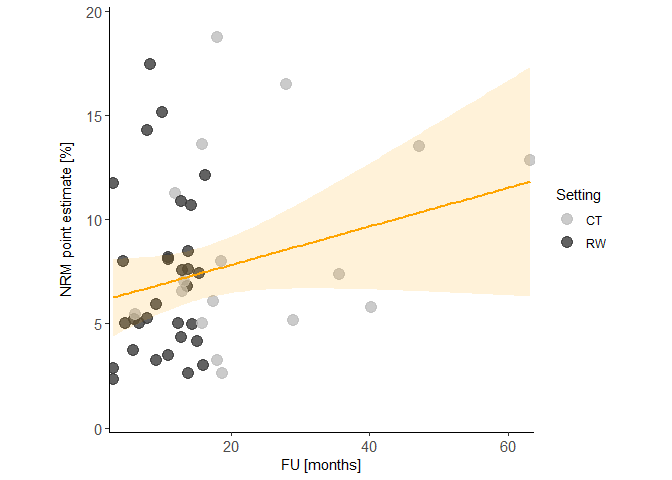<!-- -->

### Fig. S2 - 


```r
#SETTING
setting_FU <- NRM_distinct |>
  filter(FU != is.na(FU))|>
  ungroup()|>
  group_by(Setting)|>
  dplyr::summarize(median(FU))

bubble_setting <- left_join(meta_results_setting, setting_FU, 
                            by = join_by(`meta_object$subgroup.levels` == Setting))

p_bubble_setting <- ggplot()+
  geom_jitter(data = bubble_setting,
              aes(x = `median(FU)`, y = 100*PointEst.ran, size = patient_sum,
                  color = `meta_object$subgroup.levels`),
              alpha = 1, shape = 19)+
  geom_jitter(data = NRM_distinct, 
              aes(x = FU, y = 100*NRM_calculated, size = Patient_number,
                  color = Setting),
              alpha = 0.3, shape = 19)+
  # geom_text_repel(aes(label = Study_Name), size = 3)+
  # scale_size_continuous(range = c(1,8))+
  scale_size(breaks = c(100, 500, 1000, 2000, 3000), range = c(2,14))+
  labs(x = "Follow-up [months]", y = "NRM point estimate [%]", 
       color = "Setting", size = "Patients")+
  guides(color = guide_legend(override.aes = aes(size = 5)))+
  scale_fill_manual(values = c("#7AA6DCFF", "#3B3B3BFF"))+
  scale_color_manual(values = c("#7AA6DCFF", "#3B3B3BFF"))+
  theme_classic()+
  theme(panel.background = element_rect(colour = "black", size=1),
        aspect.ratio = 1, axis.text.x = element_text(size = 11),
        axis.text.y = element_text(size = 11),
        axis.title.y = element_text(size = 11, margin = margin(r = 10)),
        legend.key = element_blank())

p_bubble_setting
```

```
## Warning: Removed 1 row containing missing values or values outside the scale range
## (`geom_point()`).
```

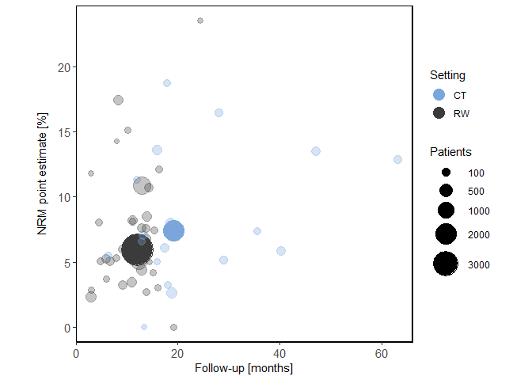<!-- -->

```r
# SETTING
# Supplementary Figure
p2_setting <- ggplot()+
  geom_errorbar(data = meta_results_setting,
                aes(x = `meta_object$subgroup.levels`, 
                    ymin = lower.ran*100, ymax = upper.ran*100,
                    color = `meta_object$subgroup.levels`), width = 0.1)+
  geom_point(data = meta_results_setting, 
             aes(x = `meta_object$subgroup.levels`, y = PointEst.ran*100,
                 color = `meta_object$subgroup.levels`), size = 6,  shape = 18,
             position = position_dodge(width = 0.1))+
  geom_jitter(data = NRM_distinct, 
              aes(x = factor(Setting, levels = c("RW", "CT")), y = NRM_calculated*100,
                  color = Setting), alpha = 0.3, shape = 19, 
              width = 0.2, height = 0.2, size = 4)+
  #coord_flip()+
  scale_color_manual(values = c("#7AA6DCFF", "#3B3B3BFF"))+
  scale_y_continuous(limits = c (0,25), expand = c(0.01,0.01))+
  labs(x = "", y = "NRM point estimate [%]")+
  # force_panelsizes(rows = unit(3.5, "in"),
  #                  cols = unit(2.5, "in"))+
  guides(fill = "none", color = "none")+
  theme_classic() +
  theme(axis.text.x = element_text(size = 11),
        axis.text.y = element_text(size = 11),
        axis.title.y = element_text(size = 11, margin = margin(r = 10)))

p2_setting <- p2_setting +
  annotate("text", x = 1.5, y = 0.8, 
           label = ifelse(meta_results_setting$p.ran[1] < 0.001, paste("p < 0.001"), paste("p =", round(meta_results_setting$p.ran[1], 3))),
           size = 4, color = "black") 

p2_setting
```

```
## Warning: Removed 2 rows containing missing values or values outside the scale range
## (`geom_point()`).
```

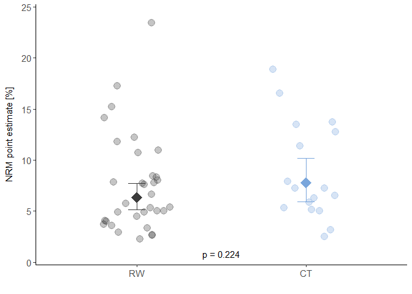<!-- -->

```r
p2_setting_FU  <-  NRM_distinct %>%
  ggplot(aes(x = factor(Setting, levels = c("RW", "CT")), y = FU))+
  geom_boxplot(aes(fill = Setting), alpha = 0.2, width = 0.5)+
  geom_point(aes(color = Setting), size = 4, alpha = 0.5)+
  geom_pwc(stat = "pwc", method = "wilcox.test", aes(label = sprintf("p = %5.4f", as.numeric("p"))),
           tip.length = 0, y.position = 50)+
  scale_color_manual(values = c("#7AA6DCFF", "#3B3B3BFF"))+
  scale_fill_manual(values = c("#7AA6DCFF", "#3B3B3BFF"))+
  scale_y_continuous(limits = c (0,60), expand = c(0.01,0.01))+
  labs(x = "", y = "FU [months]")+
  guides(fill = "none", color = "none")+
  theme_classic()+
  theme(axis.text.x = element_text(size = 11),
        axis.text.y = element_text(size = 11),
        axis.title.y = element_text(size = 11, margin = margin(r = 10)))

p2_setting_FU
```

```
## Warning in sprintf("p = %5.4f", as.numeric("p")): NAs introduced by coercion
```

```
## Warning: Removed 2 rows containing non-finite outside the scale range
## (`stat_boxplot()`).
```

```
## Warning: Removed 2 rows containing non-finite outside the scale range
## (`stat_pwc()`).
```

```
## Warning: Removed 2 rows containing missing values or values outside the scale range
## (`geom_point()`).
```

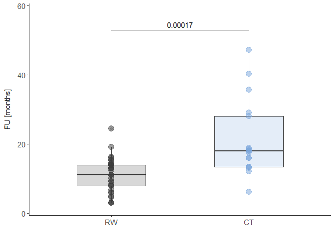<!-- -->


### Fig. S3 - Forest plot of subgroup analysis stratified by entity


```r
forest(NRM_meta_entity, overall = T, pooled.events = T,
       xlab = "NRM point estimate", weight.study = "random", 
       method.ci = "WS", common = F, random = T, smlab = "", digits = 3,
       xlim = c(0,0.25), leftcols = c("studlab", "event", "n", "effect", "ci"),
       rightcols = F, zero.pval = T, JAMA.pval = T, col.square = "darkblue",
       col.square.lines = "darkblue", col.diamond.random = "#73C2FB",
       bottom.lr = T, ff.lr = T, print.tau2 = F, header.line = T,
       width = 10, height = 10, file = "Figures/SG_Entity.svg")
```


### Fig. S4 - Forest plot of subgroup analysis stratified by products


```r
forest(NRM_meta_product, overall = T, pooled.events = T,
       xlab = "NRM point estimate", weight.study = "random", 
       method.ci = "WS", common = F, random = T, smlab = "", digits = 3,
       xlim = c(0,0.25), leftcols = c("studlab", "event", "n", "effect", "ci"),
       rightcols = F, zero.pval = T, JAMA.pval = T, col.square = "darkblue",
       col.square.lines = "darkblue", col.diamond.random = "#73C2FB",
       bottom.lr = T, ff.lr = T, print.tau2 = F, header.line = T,
       width = 10, height = 10,
       file = "Figures/SG_Product.svg")
```

### Fig. S6 - Comparison of NRM point estimates between CAR- T cell products


```r
p6_product <- ggplot()+
  geom_errorbar(data = meta_results_product_single,
                aes(x = `meta_object$subgroup.levels`,
                    ymin = lower.ran*100, ymax = upper.ran*100), width = 0.1)+
  geom_point(data = meta_results_product_single, 
             aes(x = `meta_object$subgroup.levels`,
                 y = PointEst.ran*100), 
             size = 6,  shape = 18,
             position = position_dodge(width = 0.1))+
  geom_jitter(data = NRM_distinct_single_product, 
              aes(x = Product, y = NRM_calculated*100,
              ), alpha = 0.3, shape = 19, 
              width = 0.3, height = 0.2, size = 4)+
  #  scale_fill_jco()+
  #  scale_color_jco()+
  scale_y_continuous(limits = c (0,25), expand = c(0.01,0.01))+
  scale_x_discrete(limits = c("Cilta-cel", "Brexu-cel", "Axi-cel",  "Ide-cel","Tisa-cel","Liso-cel"))+
  labs(x = "", y = "NRM point estimate [%]")+
  guides(fill = "none", color = "none")+
  theme_classic() +
  theme(axis.text.x = element_text(size = 11),
        axis.text.y = element_text(size = 11),
        axis.title.y = element_text(size = 11, margin = margin(r = 10)))

p6_product <- p6_product +
  annotate("text", x = 2, y = 18,
           label = ifelse(meta_results_product$p.ran[1] < 0.001, paste("p < 0.001"), paste("p =", round(meta_results_product$p.ran[1], 3))),
           size = 4, color = "black")

p6_product
```

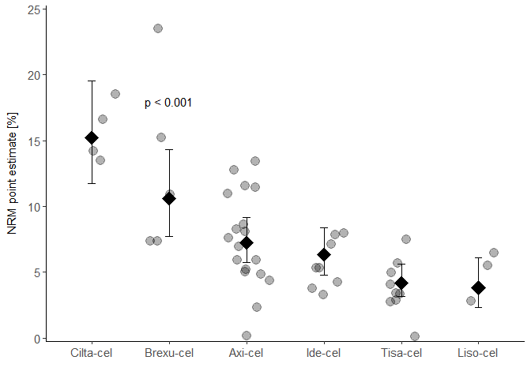<!-- -->

```r
# PRODUCT
p6_product_FU <- NRM_distinct %>%
  filter(Product != "Tisa-cel+Axi-cel")%>%# Eclusion of Lemoine_2023
  filter(Product != "Ide-cel+Cilta-cel")%>%# Eclusion of Lemoine_2023
  ggplot(aes(x = Product, y = FU))+
  geom_boxplot(width = 0.5)+
  geom_point(size = 4, alpha = 0.5)+
  #geom_pwc(stat = "pwc", method = "wilcox.test", aes(label = sprintf("p = %5.4f", as.numeric("p"))), ref.group = 1)+
  scale_x_discrete(limits = c("Cilta-cel", "Brexu-cel", "Axi-cel",  "Ide-cel","Tisa-cel","Liso-cel"))+
  stat_kruskal_test()+
  labs(x = "")+
  theme_classic()+
  theme(axis.text.x = element_text(size = 11),
        axis.text.y = element_text(size = 11),
        axis.title.y = element_text(size = 11, margin = margin(r = 10)))

p6_product_FU
```

```
## Warning: Removed 1 row containing non-finite outside the scale range
## (`stat_boxplot()`).
```

```
## Warning: Removed 1 row containing non-finite outside the scale range
## (`stat_compare_multiple_means()`).
```

```
## Warning: Computation failed in `stat_compare_multiple_means()`.
## Caused by error in `mutate()`:
## ℹ In argument: `data = map(.data$data, .f, ...)`.
## Caused by error in `map()`:
## ℹ In index: 1.
## Caused by error in `kruskal.test.default()`:
## ! all observations are in the same group
```

```
## Warning: Removed 1 row containing missing values or values outside the scale range
## (`geom_point()`).
```

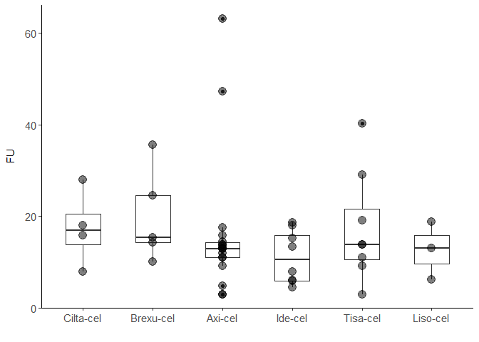<!-- -->


### Fig. S7 - Comparison of reported 1-year NRM rates for LBCL-specific products 


```r
p2_reported_product_FU12 <- NRM_distinct |> 
  filter(NRM_Timepoint == "12") |> 
  filter(Product == "Tisa-cel" | Product == "Axi-cel") |>
  ggplot(aes(x = factor(Product, levels = c("Tisa-cel", "Axi-cel")), y = NRM_Reported*100))+
  geom_boxplot(alpha = 0.5, width = 0.5)+
  geom_pwc(stat = "pwc", method = "wilcox.test", aes(label = sprintf("p = %5.4f", as.numeric("p"))), ref.group = 1,
           tip.length = 0, y.position = 11)+
  geom_point(aes(color = Product), alpha = 0.5, size = 5)+
  labs(x = "", y = "Reported NRM [%]", size = "Patients")+
  scale_color_manual(values = c( "#EFC000FF", "#EFC000FF"))+
  #scale_x_discrete(limits = c("Tisa-cel", "Axi-cel"))+
  guides(color = "none")+
  ylim(2.5,12.5)+
  theme_classic()+
  theme(axis.text.x = element_text(size = 11),
        axis.text.y = element_text(size = 11),
        axis.title.y = element_text(size = 11, margin = margin(r = 10)))

p2_reported_product_FU12
```

```
## Warning in sprintf("p = %5.4f", as.numeric("p")): NAs introduced by coercion
```

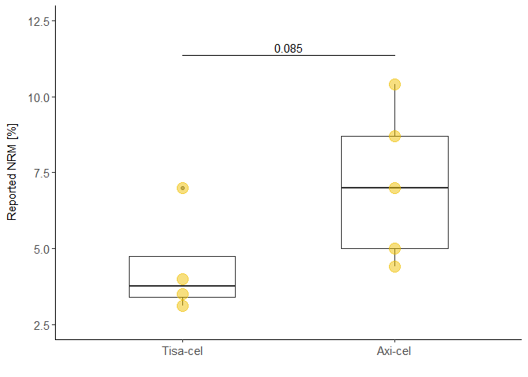<!-- -->

### Fig. S8 - 


```r
## Entity-specific differences between setting (LCBL, MM, MCL)
# Combining results in one table to visualize all results in one plot
meta_results_LBCL_setting$entity <- "LBCL"
meta_results_MM_setting$entity <- "MM"

meta_results_entity_setting <- rbind(meta_results_LBCL_setting, meta_results_MM_setting)

meta_results_entity_setting <- meta_results_entity_setting |>
  mutate(entity.setting = paste0(`meta_object$subgroup.levels`,"-",entity))


p2_LBCL_setting <- ggplot()+
  geom_errorbar(data = meta_results_entity_setting |> filter(entity.setting == "CT-LBCL" | entity.setting == "RW-LBCL"),
                aes(x = entity.setting,
                    ymin = lower.ran*100, ymax = upper.ran*100,
                    color = entity),
                width = 0.1)+
  geom_point(data =  meta_results_entity_setting |> filter(entity.setting == "CT-LBCL" | entity.setting == "RW-LBCL"),
             aes(x = entity.setting,
                 y = PointEst.ran*100,
                 color = entity),
             size = 6,  shape = 18,
             position = position_dodge(width = 0.1))+
  geom_jitter(data = NRM_distinct |> mutate(entity.setting = paste0(Setting,"-",Entity)) |> filter(entity.setting == "CT-LBCL" | entity.setting == "RW-LBCL"), 
              aes(x = entity.setting, 
                  y = NRM_calculated*100,
                  color = Entity), 
              alpha = 0.3, shape = 19, 
              width = 0.2, height = 0.2, size = 4)+
  scale_color_manual(values = c("#EFC000FF","#EFC000FF","#EFC000FF"))+
  scale_x_discrete(limits = c("CT-LBCL", "RW-LBCL")) +
  scale_y_continuous(limits = c (0,20), expand = c(0.01,0.01))+
  labs(x = "", y = "NRM point estimate [%]")+
  guides(fill = "none", color = "none")+
  # force_panelsizes(rows = unit(3.5, "in"),
  #                  cols = unit(2.5, "in"))+
  theme_classic() +
  theme(axis.text.x = element_text(size = 11),
        axis.text.y = element_text(size = 11),
        axis.title.y = element_text(size = 11, margin = margin(r = 10)))

p2_LBCL_setting <- p2_LBCL_setting +
  annotate("text", x = 0.85, y = 19.5, 
           label = ifelse(meta_results_entity_setting$p.ran[3] < 0.001, paste("p < 0.001"), paste("p =", round(meta_results_entity_setting$p.ran[3], 3))),
           size = 4, color = "black")

p2_LBCL_setting
```

```
## Warning: Removed 1 row containing missing values or values outside the scale range
## (`geom_point()`).
```

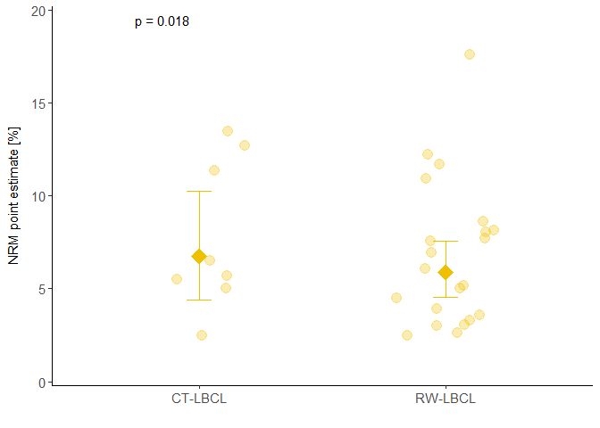<!-- -->

```r
p2_FU_LBCL <- ggplot()+
  geom_errorbar(data = meta_results_FU_LBCL,
                aes(x = `meta_object$subgroup.levels`,
                    ymin = lower.ran*100, ymax = upper.ran*100,
                    color = `meta_object$subgroup.levels`), width = 0.1)+
  geom_point(data = meta_results_FU_LBCL,
             aes(x = `meta_object$subgroup.levels`,
                 y = PointEst.ran*100, color = `meta_object$subgroup.levels`),
             size = 6,  shape = 18,
             position = position_dodge(width = 0.1))+
  geom_jitter(data = NRM_distinct_FU |> filter(Entity == "LBCL"), 
              aes(x = ifelse(FU > 13.0, "above median FU for LBCL", "below median FU for LBCL"), 
                  y = NRM_calculated*100, color = Entity), alpha = 0.3, shape = 19, 
              width = 0.3, height = 0.2, size = 4)+
  scale_color_manual(values = c( "#EFC000FF", "#EFC000FF", "#EFC000FF",
                                 "#EFC000FF", "#EFC000FF", "#EFC000FF"))+
  scale_y_continuous(limits = c (0,20), expand = c(0.01,0.01))+
  scale_x_discrete(limits = c("below median FU for LBCL", "above median FU for LBCL"), labels = c(expression("FU" <= 13), "FU > 13"))+
  labs(x = "", y = "NRM point estimate [%]")+
  guides(fill = "none", color = "none")+
  # force_panelsizes(rows = unit(3.5, "in"),
  #                  cols = unit(2.5, "in"))+
  theme_classic() +
  theme(axis.text.x = element_text(size = 11),
        axis.text.y = element_text(size = 11),
        axis.title.y = element_text(size = 11, margin = margin(r = 10)))

p2_FU_LBCL <- p2_FU_LBCL +
  annotate("text", x = 0.85, y = 19.5,
           label = ifelse(meta_results_FU_LBCL$p.ran[1] < 0.001, paste("p < 0.001"), paste("p =", round(meta_results_FU_LBCL$p.ran[1], 3))),
           size = 4, color = "black")

p2_FU_LBCL
```

```
## Warning: Removed 1 row containing missing values or values outside the scale range
## (`geom_point()`).
```

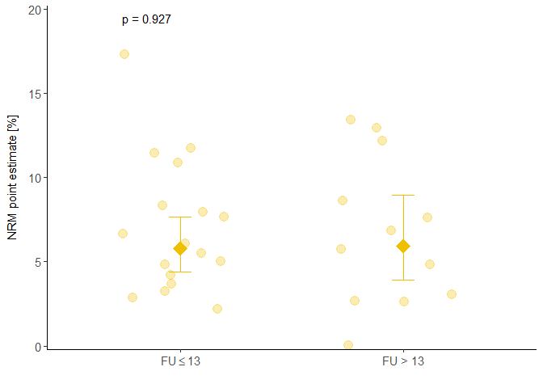<!-- -->

```r
p2_inclusion_LBCL <- ggplot()+
  geom_errorbar(data = meta_results_inclusion_LBCL,
                aes(x = `meta_object$subgroup.levels`,
                    ymin = lower.ran*100, ymax = upper.ran*100,
                    color = `meta_object$subgroup.levels`), width = 0.1)+
  geom_point(data = meta_results_inclusion_LBCL,
             aes(x = `meta_object$subgroup.levels`,
                 y = PointEst.ran*100, color = `meta_object$subgroup.levels`),
             size = 6,  shape = 18,
             position = position_dodge(width = 0.1))+
  geom_jitter(data = NRM_distinct_inclusion |> filter(Entity == "LBCL"), 
              aes(x = Inclusion_end_until_20, 
                  y = NRM_calculated*100, color = Entity), alpha = 0.3, shape = 19, 
              width = 0.3, height = 0.2, size = 4)+
  scale_color_manual(values = c( "#EFC000FF", "#EFC000FF", "#EFC000FF",
                                 "#EFC000FF", "#EFC000FF", "#EFC000FF"))+
  scale_y_continuous(limits = c (0,20), expand = c(0.01,0.01))+
  scale_x_discrete(limits = c("before", "after"), labels = c("Before 2020", "After 2020"))+
  labs(x = "", y = "NRM point estimate [%]")+
  guides(fill = "none", color = "none")+
  # force_panelsizes(rows = unit(3.5, "in"),
  #                  cols = unit(2.5, "in"))+
  theme_classic() +
  theme(axis.text.x = element_text(size = 11),
        axis.text.y = element_text(size = 11),
        axis.title.y = element_text(size = 11, margin = margin(r = 10)))

p2_inclusion_LBCL <- p2_inclusion_LBCL +
  annotate("text", x = 0.85, y = 19.5,
           label = ifelse(meta_results_inclusion_LBCL$p.ran[1] < 0.001, paste("p < 0.001"), paste("p =", round(meta_results_inclusion_LBCL$p.ran[1], 3))),
           size = 4, color = "black")

p2_inclusion_LBCL
```

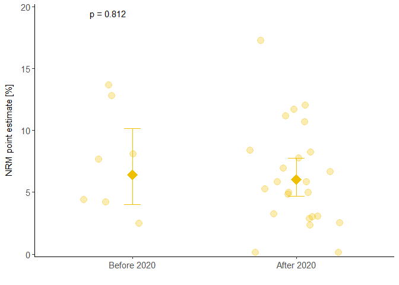<!-- -->

```r
p2_LBCL_line <- ggplot()+
  geom_errorbar(data = meta_results_LBCL_line,
                aes(x = `meta_object$subgroup.levels`, 
                    ymin = lower.ran*100, ymax = upper.ran*100,
                    color = `meta_object$subgroup.levels`), width = 0.1)+
  geom_point(data = meta_results_LBCL_line, 
             aes(x = `meta_object$subgroup.levels`, y = PointEst.ran*100,
                 color = `meta_object$subgroup.levels`), size = 6,  shape = 18,
             position = position_dodge(width = 0.1))+
  geom_jitter(data = NRM_distinct |> filter(Entity == "LBCL"), 
              aes(x = factor(Line, levels = c("earlier", "later")), y = NRM_calculated*100,
                  color = Line), alpha = 0.3, shape = 19, 
              width = 0.2, height = 0.2, size = 4)+
  scale_color_manual(values = c("#EFC000FF", "#EFC000FF"))+
  scale_y_continuous(limits = c (0,20), expand = c(0.01,0.01))+
  scale_x_discrete(limits = c("earlier", "later"), labels = c("Earlier", "Later"))+
  labs(x = "", y = "NRM point estimate [%]")+
  # force_panelsizes(rows = unit(3.5, "in"),
  #                  cols = unit(2.5, "in"))+
  guides(fill = "none", color = "none")+
  theme_classic() +
  theme(axis.text.x = element_text(size = 11),
        axis.text.y = element_text(size = 11),
        axis.title.y = element_text(size = 11, margin = margin(r = 10)))

p2_LBCL_line <- p2_LBCL_line +
  annotate("text",  x = 0.85, y = 19.5, 
           label = ifelse(meta_results_LBCL_line$p.ran[1] < 0.001, paste("p < 0.001"), paste("p =", round(meta_results_LBCL_line$p.ran[1], 3))),
           size = 4, color = "black") 

p2_LBCL_line
```

```
## Warning: Removed 1 row containing missing values or values outside the scale range
## (`geom_point()`).
```

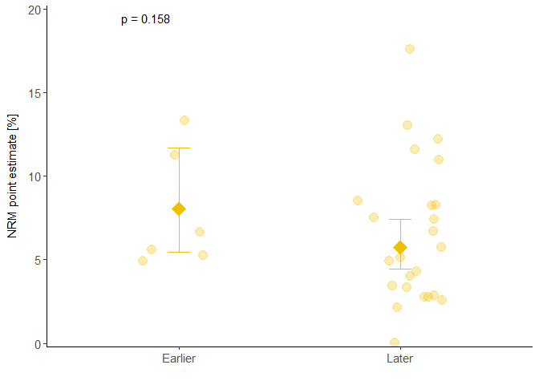<!-- -->

### Fig. S9 

```r
p2_MM_setting <- ggplot()+
  geom_errorbar(data = meta_results_entity_setting |> filter(entity.setting == "CT-MM" | entity.setting == "RW-MM"),
                aes(x = entity.setting,
                    ymin = lower.ran*100, ymax = upper.ran*100,
                    color = entity),
                width = 0.1)+
  geom_point(data =  meta_results_entity_setting |> filter(entity.setting == "CT-MM" | entity.setting == "RW-MM"),
             aes(x = entity.setting,
                 y = PointEst.ran*100,
                 color = entity),
             size = 6,  shape = 18,
             position = position_dodge(width = 0.1))+
  geom_jitter(data = NRM_distinct |> mutate(entity.setting = paste0(Setting,"-",Entity)) |> filter(entity.setting == "CT-MM" | entity.setting == "RW-MM"), 
              aes(x = entity.setting, 
                  y = NRM_calculated*100,
                  color = Entity), 
              alpha = 0.3, shape = 19, 
              width = 0.2, height = 0.2, size = 4)+
  scale_color_manual(values = c("#CD534CFF", "#CD534CFF", "#CD534CFF"))+
  scale_x_discrete(limits = c("CT-MM", "RW-MM")) +
  scale_y_continuous(limits = c (0,20), expand = c(0.01,0.01))+
  labs(x = "", y = "NRM point estimate [%]")+
  guides(fill = "none", color = "none")+
  # force_panelsizes(rows = unit(3.5, "in"),
  #                  cols = unit(2.5, "in"))+
  theme_classic() +
  theme(axis.text.x = element_text(size = 11),
        axis.text.y = element_text(size = 11),
        axis.title.y = element_text(size = 11, margin = margin(r = 10)))

p2_MM_setting <- p2_MM_setting +
  annotate("text", x = 2.2, y = 19.5, 
           label = ifelse(meta_results_entity_setting$p.ran[5] < 0.001, paste("p < 0.001"), paste("p =", round(meta_results_entity_setting$p.ran[5], 3))),
           size = 4, color = "black")

p2_MM_setting
```

```
## Warning: Removed 1 row containing missing values or values outside the scale range
## (`geom_text()`).
```

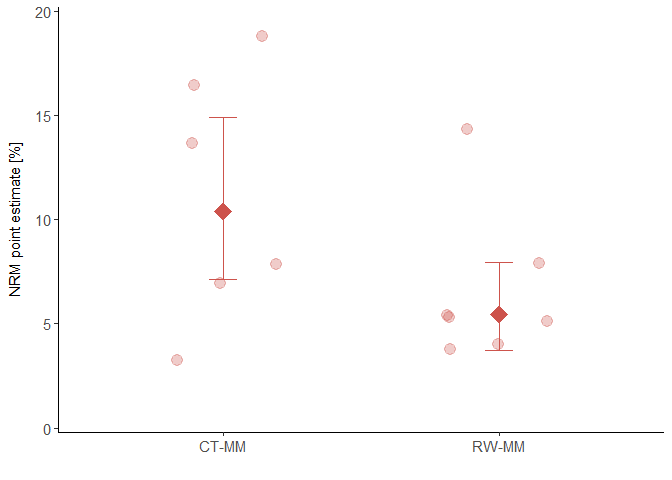<!-- -->

```r
p2_FU_MM <- ggplot()+
  geom_errorbar(data = meta_results_FU_MM,
                aes(x = `meta_object$subgroup.levels`,
                    ymin = lower.ran*100, ymax = upper.ran*100,
                    color = `meta_object$subgroup.levels`), width = 0.1)+
  geom_point(data = meta_results_FU_MM,
             aes(x = `meta_object$subgroup.levels`,
                 y = PointEst.ran*100, color = `meta_object$subgroup.levels`),
             size = 6,  shape = 18,
             position = position_dodge(width = 0.1))+
  geom_jitter(data = NRM_distinct_FU |> filter(Entity == "MM"), 
              aes(x = ifelse(FU > 13.0, "above median FU for MM", "below median FU for MM"), 
                  y = NRM_calculated*100, color = Entity), alpha = 0.3, shape = 19, 
              width = 0.3, height = 0.2, size = 4)+
  scale_color_manual(values = c("#CD534CFF",  "#CD534CFF",  "#CD534CFF",
                                "#CD534CFF", "#CD534CFF", "#CD534CFF"))+
  scale_y_continuous(limits = c (0,20), expand = c(0.01,0.01))+
  scale_x_discrete(limits = c("below median FU for MM", "above median FU for MM"), labels = c(expression("FU" <= 13.3), "FU > 13.3"))+
  labs(x = "", y = "NRM point estimate [%]")+
  guides(fill = "none", color = "none")+
  # force_panelsizes(rows = unit(3.5, "in"),
  #                  cols = unit(2.5, "in"))+
  theme_classic() +
  theme(axis.text.x = element_text(size = 11),
        axis.text.y = element_text(size = 11),
        axis.title.y = element_text(size = 11, margin = margin(r = 10)))

p2_FU_MM <- p2_FU_MM +
  annotate("text", x = 0.85, y = 19.5,
           label = ifelse(meta_results_FU_MM$p.ran[1] < 0.001, paste("p < 0.001"), paste("p =", round(meta_results_FU_MM$p.ran[1], 3))),
           size = 4, color = "black")

p2_FU_MM
```

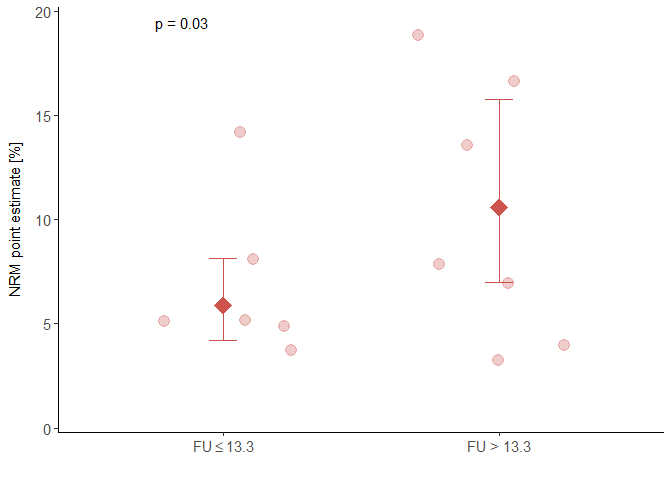<!-- -->

```r
p2_inclusion_MM <- ggplot()+
  geom_errorbar(data = meta_results_inclusion_MM,
                aes(x = `meta_object$subgroup.levels`,
                    ymin = lower.ran*100, ymax = upper.ran*100,
                    color = `meta_object$subgroup.levels`), width = 0.1)+
  geom_point(data = meta_results_inclusion_MM,
             aes(x = `meta_object$subgroup.levels`,
                 y = PointEst.ran*100, color = `meta_object$subgroup.levels`),
             size = 6,  shape = 18,
             position = position_dodge(width = 0.1))+
  geom_jitter(data = NRM_distinct_inclusion |> filter(Entity == "MM"), 
              aes(x = Inclusion_end_until_20, 
                  y = NRM_calculated*100, color = Entity), alpha = 0.3, shape = 19, 
              width = 0.3, height = 0.2, size = 4)+
  scale_color_manual(values = c( "#CD534CFF",  "#CD534CFF",  "#CD534CFF",
                                 "#CD534CFF", "#CD534CFF", "#CD534CFF"))+
  scale_y_continuous(limits = c (0,20), expand = c(0.01,0.01))+
  scale_x_discrete(limits = c("before", "after"), labels = c("Before 2020", "After 2020"))+
  labs(x = "", y = "NRM point estimate [%]")+
  guides(fill = "none", color = "none")+
  # force_panelsizes(rows = unit(3.5, "in"),
  #                  cols = unit(2.5, "in"))+
  theme_classic() +
  theme(axis.text.x = element_text(size = 11),
        axis.text.y = element_text(size = 11),
        axis.title.y = element_text(size = 11, margin = margin(r = 10)))

p2_inclusion_MM <- p2_inclusion_MM +
  annotate("text", x = 0.85, y = 19.5,
           label = ifelse(meta_results_inclusion_MM$p.ran[1] < 0.001, paste("p < 0.001"), paste("p =", round(meta_results_inclusion_MM$p.ran[1], 3))),
           size = 4, color = "black")

p2_inclusion_MM
```

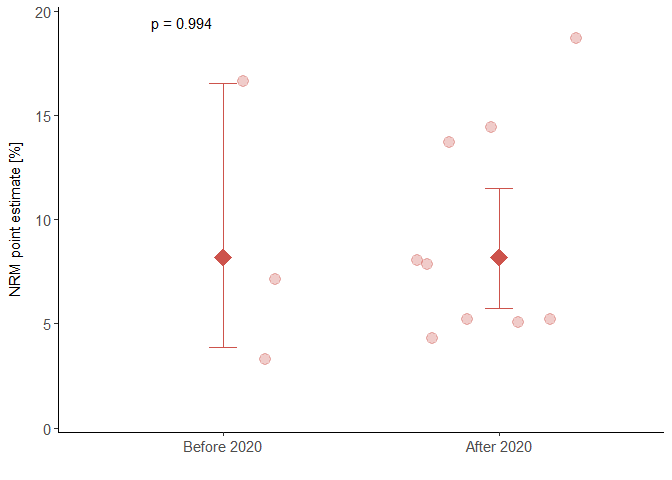<!-- -->

```r
p2_MM_line <- ggplot()+
  geom_errorbar(data = meta_results_MM_line,
                aes(x = `meta_object$subgroup.levels`, 
                    ymin = lower.ran*100, ymax = upper.ran*100,
                    color = `meta_object$subgroup.levels`), width = 0.1)+
  geom_point(data = meta_results_MM_line, 
             aes(x = `meta_object$subgroup.levels`, y = PointEst.ran*100,
                 color = `meta_object$subgroup.levels`), size = 6,  shape = 18,
             position = position_dodge(width = 0.1))+
  geom_jitter(data = NRM_distinct |> filter(Entity == "MM"), 
              aes(x = factor(Line, levels = c("earlier", "later")), y = NRM_calculated*100,
                  color = Line), alpha = 0.3, shape = 19, 
              width = 0.2, height = 0.2, size = 4)+
  scale_color_manual(values = c( "#CD534CFF",  "#CD534CFF"))+
  scale_y_continuous(limits = c (0,20), expand = c(0.01,0.01))+
  scale_x_discrete(limits = c("earlier", "later"), labels = c("Earlier", "Later"))+
  labs(x = "", y = "NRM point estimate [%]")+
  # force_panelsizes(rows = unit(3.5, "in"),
  #                  cols = unit(2.5, "in"))+
  guides(fill = "none", color = "none")+
  theme_classic() +
  theme(axis.text.x = element_text(size = 11),
        axis.text.y = element_text(size = 11),
        axis.title.y = element_text(size = 11, margin = margin(r = 10)))

p2_MM_line <- p2_MM_line +
  annotate("text", x = 0.85, y = 19.5, 
           label = ifelse(meta_results_MM_line$p.ran[1] < 0.001, paste("p < 0.001"), paste("p =", round(meta_results_MM_line$p.ran[1], 3))),
           size = 4, color = "black") 

p2_MM_line
```

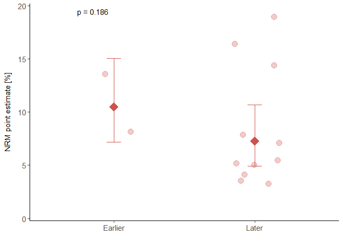<!-- -->

### Fig. S10

```r
p_cod2_setting_woCovid <- ggplot(NRM_calc_g8_setting_known_woCovid, 
                                 aes(x = setting_perc,
                                     y = setting_perc_value,
                                     fill = factor(Group2, c("HLH", "hemorrhage",
                                                             "CRS","neurotoxicity/ICANS",
                                                             "cardiovascular/respiratory", "malignancy",
                                                             "infection"))))+
  geom_col(position = "fill")+
  labs(x = "", y = "Cause of death [%]", fill = "Cause of death")+
  scale_fill_manual(values = lancet_7_rev)+
  scale_y_continuous(expand = c(0.01,0.01))+
  theme_classic()+
  theme(panel.background = element_rect(colour = "black", size=1),
        axis.text.x = element_text(size = 11),
        axis.text.y = element_text(size = 11),
        axis.title.y = element_text(size = 11, margin = margin(r = 10)),
        legend.key = element_blank())

p_cod2_setting_woCovid
```

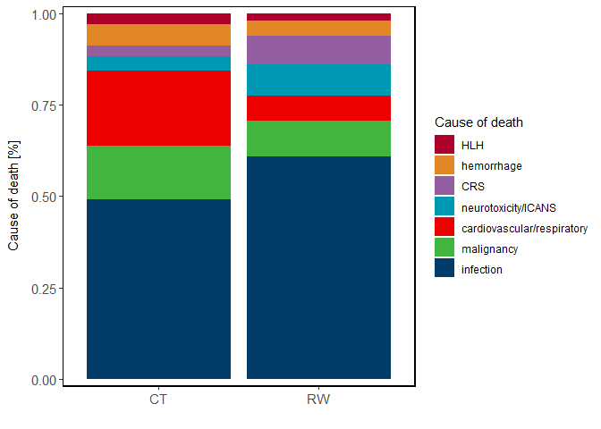<!-- -->

### Fig. S11 


```r
p_cod3_axi_comp <- NRM_calc_g8_product_known %>%
  filter(product_perc == "Axi-cel" | product_perc == "Liso-cel" | product_perc == "Tisa-cel")%>%
  ggplot(aes(x = product_perc,
             y = product_perc_value,
             fill = factor(Group2, c("HLH", "hemorrhage",
                                     "CRS","neurotoxicity/ICANS",
                                     "cardiovascular/respiratory", "malignancy",
                                     "infection"))))+
  geom_col(position = "fill")+
  labs(x = "", y = "Cause of death [%]", fill = "Causes of death")+
  scale_fill_manual(values = lancet_7_rev)+
  scale_y_continuous(expand = c(0.01,0.01))+
  theme_classic()+
  theme(panel.background = element_rect(colour = "black", size=1),
        axis.text.x = element_text(size = 11),
        axis.text.y = element_text(size = 11),
        axis.title.y = element_text(size = 11, margin = margin(r = 10)),
        legend.key = element_blank())

p_cod3_axi_comp
```

```
## Warning: Removed 4 rows containing missing values or values outside the scale range
## (`geom_col()`).
```

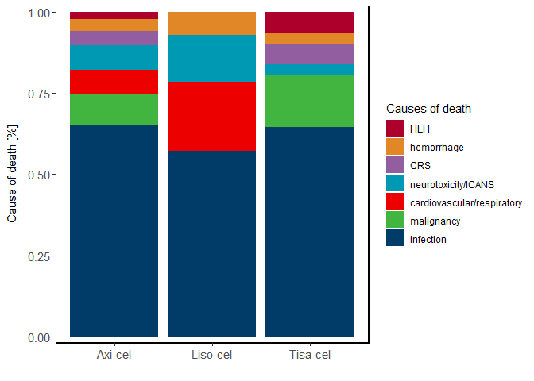<!-- -->

```r
p_cod2_ide_comp <- NRM_calc_g8_product_known %>%
  filter(product_perc == "Ide-cel" | product_perc == "Cilta-cel")%>%
  ggplot(aes(x = factor(product_perc, c("Ide-cel", "Cilta-cel")),
             y = product_perc_value,
             fill = factor(Group2, c("HLH", "hemorrhage",
                                     "CRS","neurotoxicity/ICANS",
                                     "cardiovascular/respiratory", "malignancy",
                                     "infection"))))+
  geom_col(position = "fill")+
  labs(x = "", y = "Cause of death [%]", fill = "Causes of death")+
  scale_fill_manual(values = lancet_7_rev)+
  scale_y_continuous(expand = c(0.01,0.01))+
  theme_classic()+
  theme(panel.background = element_rect(colour = "black", size=1),
        axis.text.x = element_text(size = 11),
        axis.text.y = element_text(size = 11),
        axis.title.y = element_text(size = 11, margin = margin(r = 10)),
        legend.key = element_blank())

p_cod2_ide_comp
```

```
## Warning: Removed 1 row containing missing values or values outside the scale range
## (`geom_col()`).
```

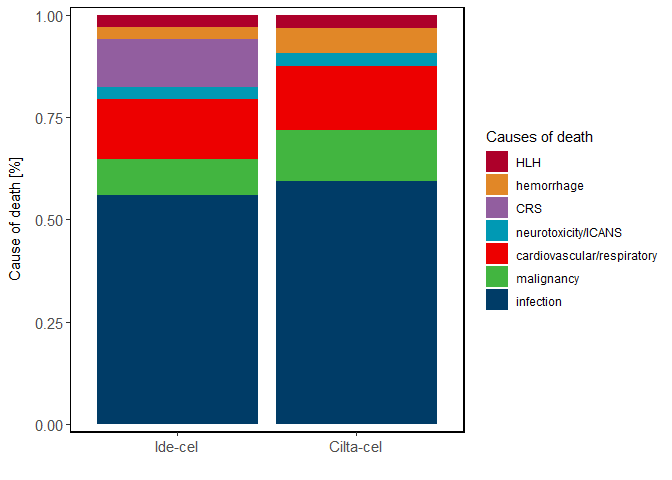<!-- -->

```r
p_cod1_brexu_comp <- NRM_calc_g8_product_known %>%
  filter(product_perc == "Brexu-cel")%>%
  ggplot(aes(x = product_perc,
             y = product_perc_value,
             fill = factor(Group2, c("CRS","neurotoxicity/ICANS",
                                     "cardiovascular/respiratory", "malignancy",
                                     "infection"))))+
  geom_col(position = "fill")+
  labs(x = "", y = "Cause of death [%]", fill = "Causes of death")+
  scale_fill_manual(values = rev(c("#003C67FF", "#ED0000FF", "#42B540FF", "#0099B4FF", "#925E9FFF")))+
  scale_y_continuous(expand = c(0.01,0.01))+
  theme_classic()+
  theme(panel.background = element_rect(colour = "black", size=1),
        axis.text.x = element_text(size = 11),
        axis.text.y = element_text(size = 11),
        axis.title.y = element_text(size = 11, margin = margin(r = 10)),
        legend.key = element_blank())

p_cod1_brexu_comp
```

```
## Warning: Removed 2 rows containing missing values or values outside the scale range
## (`geom_col()`).
```

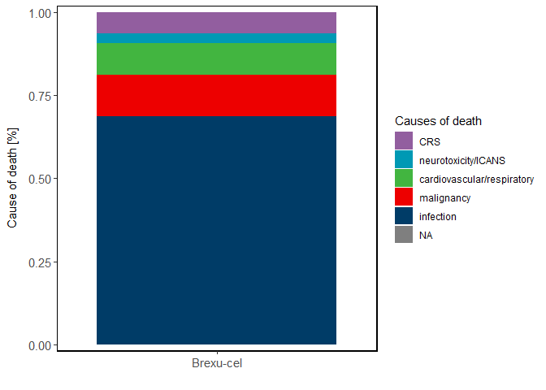<!-- -->

## Exporting figures

```r
plot_pattern_bubble <- "p_bubble_[a-zA-Z]+"
plots_bubble <- mget(ls(pattern = plot_pattern_bubble))
save_plot(plots_bubble, prefix = "Figures/", height = 6, width = 6)
```

```
## Warning: Removed 1 row containing missing values or values outside the scale range
## (`geom_point()`).
## Removed 1 row containing missing values or values outside the scale range
## (`geom_point()`).
```

```r
plot_pattern_q <- "^pq_.*"
plots_pq <- mget(ls(pattern = plot_pattern_q))
save_plot(plots_pq, prefix = "Figures/")
```

```
## `geom_smooth()` using formula = 'y ~ x'
```

```
## Warning: Removed 2 rows containing non-finite outside the scale range
## (`stat_smooth()`).
```

```
## Warning: Removed 4 rows containing missing values or values outside the scale range
## (`geom_point()`).
```

```r
plot_pattern_sq <- "^psq_.*"
plots_psq <- mget(ls(pattern = plot_pattern_sq))
save_plot(plots_psq, prefix = "Figures/",width = 6)

plot_pattern_mr <- "^pmr_.*"
plots_pmr <- mget(ls(pattern = plot_pattern_mr))
save_plot(plots_pmr, prefix = "Figures/",height = 3.5, width = 4.2)

plot_pattern_p1 <- "^p1_.*"
plots_p1 <- mget(ls(pattern = plot_pattern_p1))
save_plot(plots_p1, prefix = "Figures/",width = 2)

plot_pattern_p2 <- "^p2_.*"
plots_p2 <- mget(ls(pattern = plot_pattern_p2))
save_plot(plots_p2, prefix = "Figures/",width = 2.5)
```

```
## Warning: Removed 1 row containing missing values or values outside the scale range
## (`geom_point()`).
```

```
## Warning: Removed 2 rows containing missing values or values outside the scale range
## (`geom_point()`).
```

```
## Warning: Removed 1 row containing missing values or values outside the scale range
## (`geom_point()`).
```

```
## Warning: Removed 1 row containing missing values or values outside the scale range
## (`geom_text()`).
```

```
## Warning in sprintf("p = %5.4f", as.numeric("p")): NAs introduced by coercion

## Warning in sprintf("p = %5.4f", as.numeric("p")): NAs introduced by coercion
```

```
## Warning: Removed 2 rows containing non-finite outside the scale range
## (`stat_boxplot()`).
```

```
## Warning: Removed 2 rows containing non-finite outside the scale range
## (`stat_pwc()`).
```

```
## Warning: Removed 2 rows containing missing values or values outside the scale range
## (`geom_point()`).
```

```r
plot_pattern_p3 <- "^p3_.*"
plots_p3 <- mget(ls(pattern = plot_pattern_p3))
save_plot(plots_p3, prefix = "Figures/", width = 3.5)
```

```
## Warning: Removed 4 rows containing missing values or values outside the scale range
## (`geom_point()`).
```

```r
plot_pattern_p4 <- "^p4_.*"
plots_p4 <- mget(ls(pattern = plot_pattern_p4))
save_plot(plots_p4, prefix = "Figures/",width = 4.5)

plot_pattern_p6 <- "^p6_.*"
plots_p6 <- mget(ls(pattern = plot_pattern_p6))
save_plot(plots_p6, prefix = "Figures/",width = 6.5)
```

```
## Warning: Removed 2 rows containing missing values or values outside the scale range
## (`geom_point()`).
```

```
## Warning: Removed 1 row containing non-finite outside the scale range
## (`stat_boxplot()`).
```

```
## Warning: Removed 1 row containing non-finite outside the scale range
## (`stat_compare_multiple_means()`).
```

```
## Warning: Computation failed in `stat_compare_multiple_means()`.
## Caused by error in `mutate()`:
## ℹ In argument: `data = map(.data$data, .f, ...)`.
## Caused by error in `map()`:
## ℹ In index: 1.
## Caused by error in `kruskal.test.default()`:
## ! all observations are in the same group
```

```
## Warning: Removed 1 row containing missing values or values outside the scale range
## (`geom_point()`).
```

```r
plot_pattern_pcod1 <- "^p_cod1.*"
plots_pcod1 <- mget(ls(pattern = plot_pattern_pcod1))
save_plot(plots_pcod1, prefix = "Figures/")
```

```
## Warning: Removed 2 rows containing missing values or values outside the scale range
## (`geom_col()`).
```

```r
plot_pattern_pcod2 <- "^p_cod2.*"
plots_pcod2 <- mget(ls(pattern = plot_pattern_pcod2))
save_plot(plots_pcod2, prefix = "Figures/", width = 4.5)
```

```
## Warning: Removed 1 row containing missing values or values outside the scale range
## (`geom_col()`).
```

```r
plot_pattern_pcod3 <- "^p_cod3.*"
plots_pcod3 <- mget(ls(pattern = plot_pattern_pcod3))
save_plot(plots_pcod3, prefix = "Figures/",width = 5)
```

```
## Warning: Removed 4 rows containing missing values or values outside the scale range
## (`geom_col()`).
```

```r
plot_pattern_pcod4 <- "^p_cod4.*"
plots_pcod4 <- mget(ls(pattern = plot_pattern_pcod4))
save_plot(plots_pcod4, prefix = "Figures/",width = 5.5)
```

```
## Warning: Removed 5 rows containing missing values or values outside the scale range
## (`geom_col()`).
```


# R Session

```r
sessionInfo()
```

```
## R version 4.3.1 (2023-06-16 ucrt)
## Platform: x86_64-w64-mingw32/x64 (64-bit)
## Running under: Windows 10 x64 (build 19045)
## 
## Matrix products: default
## 
## 
## locale:
## [1] LC_COLLATE=English_United States.utf8 
## [2] LC_CTYPE=English_United States.utf8   
## [3] LC_MONETARY=English_United States.utf8
## [4] LC_NUMERIC=C                          
## [5] LC_TIME=English_United States.utf8    
## 
## time zone: America/New_York
## tzcode source: internal
## 
## attached base packages:
## [1] stats     graphics  grDevices utils     datasets  methods   base     
## 
## other attached packages:
##  [1] readr_2.1.4         dplyr_1.1.4         ggpubr_0.6.0       
##  [4] ggplot2_3.5.0       tidyr_1.3.1         openxlsx_4.2.5.2   
##  [7] readxl_1.4.3        metafor_4.4-0       numDeriv_2016.8-1.1
## [10] Matrix_1.6-1.1      meta_7.0-0          metadat_1.2-0      
## 
## loaded via a namespace (and not attached):
##  [1] gtable_0.3.4       xfun_0.42          bslib_0.6.1        rstatix_0.7.2     
##  [5] CompQuadForm_1.4.3 lattice_0.21-8     mathjaxr_1.6-0     tzdb_0.4.0        
##  [9] vctrs_0.6.5        tools_4.3.1        generics_0.1.3     parallel_4.3.1    
## [13] tibble_3.2.1       fansi_1.0.6        highr_0.10         pkgconfig_2.0.3   
## [17] lifecycle_1.0.4    farver_2.1.1       compiler_4.3.1     stringr_1.5.1     
## [21] munsell_0.5.0      carData_3.0-5      htmltools_0.5.7    sass_0.4.9        
## [25] yaml_2.3.8         crayon_1.5.2       pillar_1.9.0       car_3.1-2         
## [29] nloptr_2.0.3       jquerylib_0.1.4    MASS_7.3-60        cachem_1.0.8      
## [33] abind_1.4-5        boot_1.3-28.1      nlme_3.1-162       tidyselect_1.2.1  
## [37] zip_2.3.0          digest_0.6.35      stringi_1.8.3      purrr_1.0.2       
## [41] labeling_0.4.3     splines_4.3.1      fastmap_1.1.1      grid_4.3.1        
## [45] colorspace_2.1-0   cli_3.6.1          magrittr_2.0.3     utf8_1.2.4        
## [49] broom_1.0.5        withr_3.0.0        scales_1.3.0       backports_1.4.1   
## [53] bit64_4.0.5        rmarkdown_2.26     bit_4.0.5          lme4_1.1-34       
## [57] ggsignif_0.6.4     cellranger_1.1.0   hms_1.1.3          pbapply_1.7-2     
## [61] evaluate_0.23      knitr_1.45         mgcv_1.8-42        rlang_1.1.3       
## [65] Rcpp_1.0.12        glue_1.7.0         xml2_1.3.5         vroom_1.6.4       
## [69] rstudioapi_0.15.0  minqa_1.2.6        jsonlite_1.8.8     R6_2.5.1
```


